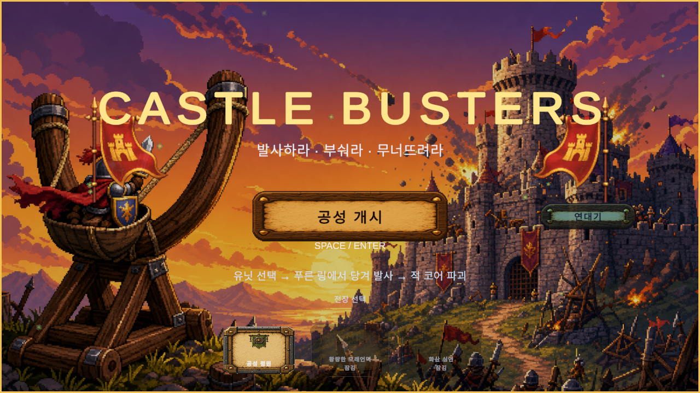
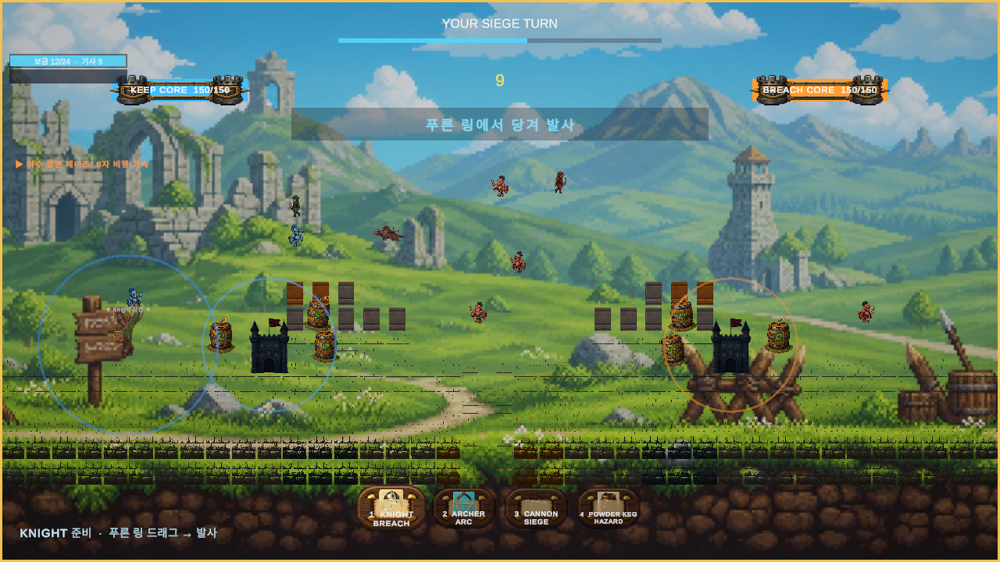

# castle-war

<p align="center">
  
</p>

<p align="center">
  <b><a href="https://jellyggumi.github.io/games/castle-war/">▶ Play in the browser</a></b> · no install, runs on desktop and mobile
</p>

A two-dimensional siege game. You haul a unit into the sling, pull it back through a blue
ring, and let physics do the rest — the shot arcs, the wall answers, and whatever was
holding up the course above comes down with it. Take the enemy keep before yours falls.


---

## Watch a siege

<video src="docs/CastleBusters_IntroToGameplay.mp4" controls muted loop width="820"></video>

If the player above does not load, [download the clip](docs/CastleBusters_IntroToGameplay.mp4)
— GitHub only renders inline video on some views.

<p align="center">
  
</p>

---

## How it plays

**Drag, aim, release.** Pick a card, drag inside the blue ring, and let go. The further you
pull, the harder it lands. Wind pushes the shot, and it pushes harder the further the shot
travels — so the long shot across the field is never the safe one.

**Break the wall, then the core.** Each keep is an outpost, three wall courses stepping up
toward the core, and the core itself. Blocks fall on each other, so where you hit matters
more than how often.

**Four ways in.**

| Card | Role |
|---|---|
| **Knight** | Body damage up close, where armour and combo pressure decide it |
| **Archer** | Range — wins the open field before a Knight can close |
| **Cannon** | Artillery. Splash damage, deploy-only, and **locked until you breach two enemy wall blocks** |
| **Powder Keg** | A hazard you place, not a shot you take |

**The battery has to be earned.** Artillery is the one card time alone will not give you:
open a hole in the enemy wall first, then move the guns up. The forward outpost is exactly
two blocks, so clearing the outwork is what unlocks it.

**Three battlefields.** Siege Plain, then Ashen Bastion and Frostbound Gorge, each with its
own board width, wall height, obstacle budget, and weather. Later stages unlock by winning
a best-of-three series, not a single game.

---

## The numbers behind it

Two things in this game are decided by a formula rather than by argument, and both are
written down so they can be checked instead of relitigated.

### How long a match should run

`MatchLengthModel` — the target is the input, the fortress is derived from it.

```
M = b·h + c            material one side must lose
N = M / d              turns to decide
T = N·s                seconds to decide
```

| Term | Meaning | Shipped |
|---|---|---|
| `b` | blocks in one keep | 14 |
| `h` | health per wall block | 85 |
| `c` | keep core health | 150 |
| `d` | effective damage landed per turn | 42 |
| `s` | seconds a player actually spends on a turn | 8.5 |

That puts a decided match at **T ≈ 271 s**, against a **300 s target** — inside the ±20%
band a test enforces in both directions, because too thin ends matches early and too thick
grinds. Note that `s` is *not* the 15-second turn timer; the timer is a ceiling players
rarely reach.

The core sits at 150 while the walls carry the length, and that asymmetry is deliberate:
two batteries have to breach a core inside one Cannon cooldown, and that gate is already at
its limit. Raising the core needs more artillery throughput, and every route to throughput
pushes the cannon past the efficiency ceiling that keeps the three combat roles distinct.
The walls had no such constraint, so the length went there.

### How difficulty rises

`DifficultyCurve` — a hill curve, so pressure keeps rising and never flattens out.

```
D(n) = n^p / (n^p + k^p)        k = 0.6 · rampTurns,  p = 1.8
```

It replaced a smoothstep that pinned at 1.0 around turn 15 and stopped meaning anything
after. Wind and AI accuracy read from `D(n)`, so late turns actually feel late.

---

## Metrics

| | |
|---|---|
| EditMode tests | **346 passing** |
| PlayMode tests (core suite) | **45 / 46** |
| Modeled match length | 271 s vs 300 s target |
| Keep material per side | 1340 (14 blocks × 85 + 150 core) |
| Stages | 3, unlocked by best-of-three series |
| Deploy cards | 4 |
| Build | WebGL, ~85 MB compressed |
| Engine | Unity 2022.3.62f2, 2D URP, IL2CPP |

---

## Build and run

```bash
# Play locally against the shipped build
python3 -m http.server 8000 --directory Builds/WebGL/castle-war

# Regression suite (close the editor first — it holds the project lock)
"/Applications/Unity/Hub/Editor/2022.3.62f2/Unity.app/Contents/MacOS/Unity" \
  -batchmode -projectPath . -runTests -testPlatform EditMode \
  -testResults ./editmode-results.xml -logFile ./editmode-test.log

# WebGL release build
"/Applications/Unity/Hub/Editor/2022.3.62f2/Unity.app/Contents/MacOS/Unity" \
  -batchmode -quit -projectPath . -buildTarget WebGL \
  -executeMethod WebGLReleaseBuild.Build -logFile ./webgl-build.log
```

---

## Repository

| Path | Contents |
|---|---|
| `Assets/Scripts/` | Gameplay, balance rules, VFX |
| `Assets/Tests/`, `Assets/Editor/` | EditMode and PlayMode suites |
| `_workspace/current/` | The live design, QA, and production lane |
| `docs/changelog.md` | Verification history, pass by pass |
| `CLAUDE.md` | Working agreement for agents on this repository |

Korean text on WebGL depends on a **static** TextMeshPro atlas: browsers expose no OS fonts,
and rasterising CJK glyphs at runtime overflows the WASM stack. `KoreanFontAssetBuilder`
bakes every non-ASCII character used in the UI — if you add a new one, re-bake or it ships
as tofu.

## License

MIT.
