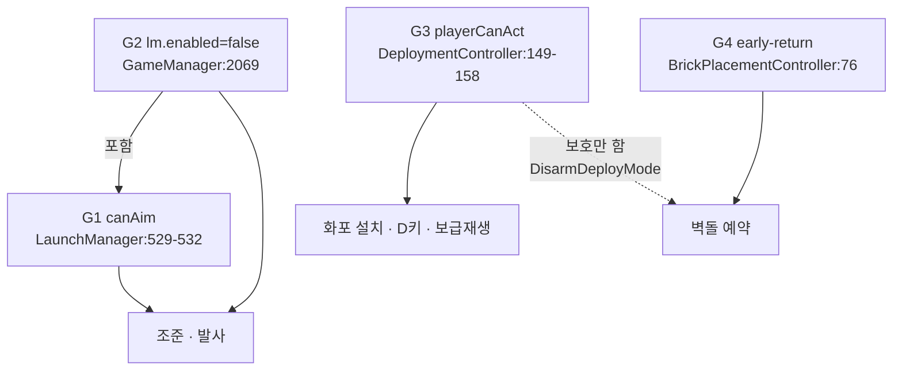

# 랠리 기믹 구현 타당성 — 적 턴 입력 되살리기

- run-id: 20260813-castle-war-stage1-phase1b
- 레인: Game Programmer (아키텍처)
- 코드 수정: **0줄** (분석 전용)
- 근거 기준: `[OBSERVED]` = 코드/커밋에서 직접 읽음, `[INFERENCE]` = 읽은 것에서 유도

---

## 0. 핵심 질문에 대한 답

> **"적 턴 입력을 되살리는 것이 한 줄 설정 변경인가, 기능 구현인가?"**

**동사마다 다르다. 세 가지 답이 각각 존재하며, 셋 다 코드 근거가 있다.**

| 되살리려는 동사 | 답 | 코드 근거 |
|---|---|---|
| **벽돌 예약** (D3) | **한 줄이면 입력은 켜진다. 그러나 한 줄로는 못 켠다.** | `BrickPlacementController.cs:76` early-return 하나가 유일한 차단자. 그런데 그 한 줄을 열면 판당 최대 6,426 HP의 무상 자재가 생기고, 페이싱 예산은 **42.9 HP**다 (§2.4). AI 미러도 없다 (§3). |
| **조준** (D2) | **기능 구현. 단, 상태는 이미 있다.** 게이트 2개를 수술해야 하지만 `aimAngleDegrees`/`aimPower`는 이미 턴 경계를 넘어 보존된다 (§5.4). | `LaunchManager.cs:529-532` + `GameManager.cs:2069`. §1.5-C |
| **화포 설치** | **한 줄이면 켜지지만, 켜는 순간 턴 강탈 익스플로잇이 된다.** | `DeploymentController.cs:149-158`을 열면 `TryDeploy:322`가 적 턴에 `TryCommitTurnShot()`을 호출 → `SimpleAI.cs:67`이 `yield break` → **적 턴이 15초 죽은 턴이 된다** (§1.5-B). |

**한 줄짜리 진짜 후보인 `GameManager.cs:144` `enforceOneShotTurns = false`는 설정 변경이 아니라 설계 되돌리기다.** 이 플래그는 6개 파일 10개 지점에서 읽히고 (§5.1), 뒤집으면 발사체 순환(G8 후보 N-2), 첫플레이 코치, 텔레메트리 라벨, AI 대칭성이 함께 죽는다.

### 0.1 블로커는 3개이며 서로 독립이다

설계 레인(DesignerGimmicks) · QA 레인(QAUxDefects)과 교차 검증한 결과, **벽돌(D3) 재활성을 막는 것은 하나가 아니라 셋이고, 하나를 고쳐도 나머지가 남는다.**

| 블로커 | 깨는 게이트 | 고치는 방법 | 고치면 해결되나 |
|---|---|---|---|
| **B1. AI 미러 부재** | G2 승률 45~55% | `AiBrickPlanner` 신규 + `ghosts` 진영 분리 (§3) | ❌ B2가 남는다. 오히려 **양 진영 자재가 2배가 되어 B2가 악화된다** |
| **B2. 자재 순증** | G7 5분 페이싱 (270~330초) | 자재 보존형 재설계 (§2.7 C3′) | ❌ B1이 남는다. 별도로 AI 미러가 필요하다 |
| **B3. 선택 패널이 화면 밖** | G4 몰입 (조작 불가) | `BrickPlacementController.cs:292` 좌표 수정 (§2.8) | ❌ B1·B2 무관. **그리고 게이트를 열기 전에는 증상이 보이지 않는다** |

**세 블로커는 직교한다.** B1만 고치면 경기가 1,800초가 되고, B2만 고치면 플레이어만 방어 채널을 가지며, B3만 고치면 누를 수 있는 버튼이 잘못된 게임을 만든다. **`:76` early-return 한 줄 삭제는 셋 중 어느 것도 건드리지 않는다.**

> **B3이 지금 안 보이는 이유:** `:76` early-return이 `:84-88 CreateBlockUI()`보다 위에 있다. 원샷 모드에서는 패널이 **생성된 적조차 없다.** 게이트를 여는 순간 처음 만들어지고, 만들어지자마자 화면 밖이다. `[OBSERVED]`

---

## 1. 입력 차단 경로 3개 추적

### 1.1 게이트 G1 — 조준 차단 `LaunchManager.cs:528-532` `[OBSERVED]`

```csharp
var gameManager = GameManager.Instance;
bool canAim = gameManager != null
    && gameManager.currentState == GameState.PlayerTurn   // :530
    && gameManager.IsPlayerTurn;                           // :531
if (canAim && selectedUnitPrefab != null && !deployArmed) HandleInput();  // :532
```

- **막는 것:** 드래그 시작, 궤적 프리뷰, 고무줄, 릴리즈→발사. `HandleInput()` 전체.
- **왜 막는가:** 커밋 `bf491069` (`feat: land the full siege pass`)에서 도입. 코드 주변 주석(`:524-525`)이 밝히는 의도는 배치/조준 상호배타(`deployArmed`)이고, 턴 조건 자체는 "내 턴에만 내가 쏜다"는 자명한 턴제 규칙이다. **적 턴 입력을 막으려는 의도적 설계가 아니라, 발사 권한 검사의 부수효과다.** `[INFERENCE]`
- **부수효과:** `:544` `bool isPlayerTurn = canAim;` — 같은 불리언이 발사점 인디케이터(`:554`)와 힌트 라벨(`:578`) 표시도 좌우한다. 즉 적 턴에는 조준 어포던스 자체가 화면에서 사라진다.

### 1.2 게이트 G2 — 컴포넌트 전체 정지 `GameManager.cs:2068-2069`, `2120` `[OBSERVED]`

```csharp
private IEnumerator WaitAndEndTurn(UnitController launchedUnit)
{
    var lm = FindObjectOfType<LaunchManager>();
    if (lm != null) lm.enabled = false;      // :2069
    ... 발사체 결착 대기(최대 12s) → PostImpactHold 0.35s → 정착 최대 1.2s ...
    if (lm != null) lm.enabled = true;       // :2120
    isResolvingTurn = false;
    EndTurn();
}
```

- **막는 것:** `LaunchManager.Update()` **전체**. G1은 `Update()` 안에 있으므로 **G2는 G1을 포함한다.**
- **결정적 사실: G2는 적 턴 전용이 아니다.** `WaitAndEndTurn`은 `OnUnitLaunched`(`:2053`)에서 호출되고, 이는 **플레이어 발사와 AI 발사 양쪽**이 부른다. 따라서 G2가 덮는 구간은:
  - 적 턴 결착 구간 (유휴 34.1% 중 대부분)
  - **내 턴 발사 후 꼬리 구간** (유휴 28.1% 전체)
- **왜 막는가:** 커밋 `b639788c`부터 존재. `:2071-2075`, `:2092-2098` 주석이 밝히는 의도는 **"이중 EndTurn 방지 + 결착 중 상태 오염 방지"**다. `GameManager.Update():1717-1720`이 같은 의도를 다른 방식으로 적는다 — *"결착 중에는 시계가 멈춰야 한다. 만기가 나면 EndTurn이 Update와 WaitAndEndTurn 양쪽에서 이중 발화해 다음 턴을 통째로 건너뛴다."*
- **여기서 나오는 구조적 관찰:** 이중 발사를 실제로 막는 규칙은 `lm.enabled`가 아니라 `TryCommitTurnShot()`(`:181` `if (... isResolvingTurn) return false`)이다. **`lm.enabled=false`는 규칙이 아니라 입력 어포던스 차단이다.** 즉 이 게이트는 규칙을 지키기 위해 필요한 것이 아니라, 규칙에 걸릴 입력을 애초에 못 하게 하는 UX 장치다. `[INFERENCE]` — 근거: `:994`와 `:181`이 이미 이중 발사를 독립적으로 거부한다.

### 1.3 게이트 G3 — 배치 HUD 차단 `DeploymentController.cs:149-158` `[OBSERVED]`

```csharp
bool playerCanAct = gm.currentState == GameState.PlayerTurn
    && gm.IsPlayerTurn && !gm.IsResolvingTurn;    // :149-150
EnsureHud();
SetHudVisible(playerCanAct);                       // :153
if (!playerCanAct)
{
    DisarmDeployMode();                            // :156
    return;                                        // :157
}
```

- **막는 것:** 화포 HUD, `D` 키(`:222`), 배치 클릭(`:226-233`), 그리고 **보급 재생(`:161`)과 쿨다운 감소(`:162-165`)까지**. 적 턴에는 플레이어 보급이 아예 자라지 않는다.
- **왜 막는가:** 커밋 `0a7dccb7` (`feat(aim+scale+cannon)`)의 메시지가 명시한다 — *"placing it consumes the turn exactly as a volley does (the one-shot gate commits before supply is spent), keeping one action per turn."* **의도는 "적 턴 차단"이 아니라 "턴당 1행동 불변식 유지"다.** 적 턴 차단은 그 불변식의 구현 수단이다.

### 1.4 의존 관계 — 체인이 아니라 동사별 독립 게이트



**세 게이트는 서로를 막지 않는다. 서로 다른 동사를 막는다.** 유일한 포함 관계는 G2 ⊃ G1이다.

네 번째 게이트(G4)가 존재한다는 점이 중요하다. 과제가 지목한 3개 경로 중 **어느 것도 벽돌 예약을 막고 있지 않다.** 벽돌을 막는 것은 `BrickPlacementController.cs:76` 하나뿐이다.

**동사 × 시간창 매트릭스** `[OBSERVED]`

시간창 정의 (QA `idle-time-measurement.md:252-277` 기준: 내 턴 P=9.89s, 적 턴 A=5.12s):

| 시간창 | 길이 | state | isPlayerTurn | isResolvingTurn | lm.enabled |
|---|---|---|---|---|---|
| W1 내 턴 조준 | 5.67s | PlayerTurn | true | false | true |
| W2 내 턴 결착 꼬리 | 4.22s | PlayerTurn | true | **true** | **false** |
| W3 적 턴 선지연 | 0.9s | AITurn | false | false | true |
| W4 적 턴 결착 | 4.22s | AITurn | false | **true** | **false** |

| 동사 | W1 | W2 | W3 | W4 | 차단자 |
|---|---|---|---|---|---|
| 조준/발사 | ✅ | ❌ | ❌ | ❌ | W2=G2, W3=G1, W4=G1+G2 |
| 화포 설치 | ✅ | ❌ | ❌ | ❌ | G3 전 구간 |
| 벽돌 예약 | ❌(설계상) | ❌(설계상) | ⛔ | ⛔ | **G4 단독** (`:76`) |

- ⛔ = 원샷 모드가 아니면 열려 있는 창. `BrickPlacementController.cs:96`이 `AITurn`만 허용하므로 벽돌은 **W3+W4 = 5.12초, 유휴의 34.1% 전체**를 정확히 겨냥한다. `[OBSERVED]`
- 벽돌 경로에는 `isResolvingTurn` 검사가 없다 (`:67-100` 전체). 즉 **적 발사체가 날아가는 중에도 예약이 가능하다.** 이것이 D2(상대 행동 중 입력)의 정의 그 자체다.

### 1.5 하나만 열면 어떻게 되나 — 케이스별

**A. G4만 열기 (벽돌)**
→ 입력은 즉시 켜진다. 다른 두 게이트는 벽돌을 막지 않는다. G3는 오히려 **도와준다**: `:156` `DisarmDeployMode()`가 적 턴에 배치 모드를 강제 해제하므로, `BrickPlacementController.cs:106`의 `deployArmed` 클릭 충돌 가드가 원샷 모드에서는 구조적으로 발화할 수 없다. **원샷 모드에서 early-return이 막으려던 위험(클릭 이중 소비)은 이미 G3가 제거했다.** `[OBSERVED]`
→ 그러나 페이싱과 대칭성이 깨진다. §2.4, §3.

**B. G3만 열기 (화포) — 턴 강탈 익스플로잇**
```
플레이어가 적 턴에 화포 클릭
 → TryDeploy(:322) → gm.TryCommitTurnShot()
 → GameManager:182 oneShotTurnGate.TryCommitShot() → true, 게이트 커밋됨
 → TryDeploy:350 gm.OnUnitLaunched(null) → isResolvingTurn=true, WaitAndEndTurn 시작
 → 잠시 후 SimpleAI:67 if (!TryCommitTurnShot()) yield break;  ← 적이 조용히 기권
 → SimpleAI가 OnUnitLaunched를 부르지 않음 → EndTurn 호출 없음
 → GameManager.Update:1754 turnTimer(15s) 만기 → DecideTurnExpiry(false,...) = EndTurn
```
`OneShotTurnGate`는 `GameManager`가 소유한 **단일 인스턴스**이며 진영 구분이 없다 (`:145`, `OneShotSiegeRules.cs:47-58`). 게이트를 먼저 커밋한 쪽이 상대의 발사권을 먹는다.
**결과: 적 턴이 15초짜리 죽은 턴이 된다 — 유휴를 줄이려다 유휴를 3배로 늘린다.** `[OBSERVED]` (코드 경로 전부 확인, 실행 검증은 아님)

**C. G1만 열기 (조준)**
→ W3(0.9초)만 열린다. W4(4.22초)는 G2가 `Update()` 자체를 끄고 있어 여전히 닫힌다. **적 턴 5.12초 중 17.6%만 회복.**
→ 게다가 릴리즈가 `HandleInput` → `:994 TryCommitTurnShot()`에 도달하는데, W3에서는 `isResolvingTurn=false`이고 게이트도 미커밋이라 **통과한다.** 즉 G1만 열면 플레이어가 적 턴에 **실제로 발사할 수 있다.** 이는 케이스 B와 동일한 턴 강탈이다.
→ **G1을 여는 어떤 구현도 "예약은 되되 발사는 안 되는" 새 상태를 반드시 만들어야 한다.** 이것이 §0에서 조준을 "기능 구현"으로 분류한 이유다.

**D. G2만 열기**
→ G1이 안에서 막으므로 조준은 안 켜진다. 대신 `Update()` 전체(궤적 색 애니메이션 `:535-542`, 인디케이터 펄스 `:546-574`, 경계선 `:582`, 마커 타이머 `:584-604`)가 결착 중에도 계속 돈다. **입력 효과 0, 프레임 비용만 증가.** 단독으로는 무의미.

---

## 2. `BrickPlacementController` 예약 경로의 현재 상태

### 2.1 early-return 조건 `[OBSERVED]`

`BrickPlacementController.cs:76-82`:
```csharp
if (gm.EnforcesOneShotTurns)
{
    // Reserving bricks is a placement action, so it is unavailable in the
    // aim-once/fire-once loop just like roster deployment.
    if (blockUIPanel != null) blockUIPanel.SetActive(false);
    return;
}
```
- 도입 커밋: `49d4ed73` — 원샷 턴 도입 커밋. 벽돌은 원샷 오버홀에서 **의도적으로 무력화**되었다. 버그가 아니다.
- 주석이 밝히는 근거: *"배치 행동이므로 로스터 배치와 마찬가지로 불가"* — 즉 "턴당 1행동" 불변식을 지키려는 판단.
- **그러나 §2.3이 보이듯 벽돌 예약은 실제로는 턴 행동을 소비하지 않는다.** 이 주석의 전제가 코드와 어긋난다.

### 2.2 예약 상한 · 실체화 시점 `[OBSERVED]`

| 항목 | 값 | 위치 |
|---|---|---|
| 동시 예약 상한 | 2 | `SiegeTactics.cs:40` `MaxPendingBricks = 2` |
| 지정 창 | `AITurn`만 | `BrickPlacementController.cs:96` |
| 배치 금지 구역 | 발사링 ±14.5 r3.5, \|x\|>10.5, y∉[0,8], 적 유닛 위 | `SiegeTactics.cs:45-62` |
| 취소 | 고스트 0.7 이내 재클릭 | `:126-134` |
| 실체화 | `EndTurn` 안, `isPlayerTurn==true`일 때 | `GameManager.cs:2149` → `:197-199` |
| 실체화 후 | Dynamic Rigidbody2D, `isGroundAnchor=false`, 적 유닛과 `IgnoreCollision` | `:246-271` |
| 기본 재질 | **Stone (85 HP)** | `:24`, `Resources/StoneBlockData.asset` |
| 선택 가능 재질 | Wood 30 / Stone 85 / **Iron 150** | 3개 에셋 |
| 비용 | **없음** — 보급·쿨다운·브리치 검사 전무 | `:67-152` 전체에 `SupplyRules`/`PlayerSupply` 참조 0건 |

`MaxPendingBricks=2`는 **동시 미실체화 개수** 상한이지 누적 상한이 아니다. 매 적 턴마다 2개씩 새로 예약할 수 있다.

### 2.3 원샷 게이트와 충돌하는가 — **충돌하지 않는다** `[OBSERVED]`

세 가지 코드 근거:

1. **지정은 게이트를 만지지 않는다.** `BrickPlacementController.cs` 전체(408줄)에 `TryCommitTurnShot` 호출이 0건이다. `TryCommitTurnShot`의 전체 호출처는 4곳뿐이며(`LaunchManager:994`, `SimpleAI:67`, `DeploymentController:322`, 정의 `GameManager:179`) 벽돌은 없다.
2. **실체화 순서가 안전하다.** `EndTurn()` 안에서
   `:2138 BeginOneShotTurn()` → `oneShotTurnGate.BeginTurn()` (게이트 리셋)
   → `:2149 BrickPlacementController.OnTurnChanged(isPlayerTurn)`
   벽돌이 생길 때 게이트는 **이미 새 턴용으로 리셋된 뒤**다. 벽돌이 그 턴의 발사권을 먹을 수 없다.
3. **클릭 이중 소비도 불가능하다.** `:106`의 `deployArmed` 가드가 필요한 상황 자체가 원샷 모드에는 없다 — G3(`:156`)가 적 턴에 배치 모드를 강제 해제하기 때문이다.

**결론: `:76` early-return이 방어하려던 위험 세 가지가 원샷 모드에서는 전부 이미 다른 곳에서 막혀 있다. 이 게이트는 현재 아무것도 지키지 않는다.**

### 2.4 진짜 블로커 — 페이싱 예산 `[OBSERVED 산술 / INFERENCE 흡수율]`

기준값 (`MatchLengthModel.cs:45,51`, `StageDefinitions.cs:127`, QA `idle-time-measurement.md:216-221`):

```
M = 1585 HP,  d = 37 HP/턴,  s = 7.5 초/턴
N = M/d = 42.84 턴   →   플레이어 턴 = 21.42
T = N·s = 321.3 초   (밴드 270~330, 허용오차 ±20% = 240~360)

자재 1 HP의 시간 가격:  dT/dM = s/d = 7.5/37 = 0.2027 초/HP
밴드 상한까지 여유: 330 − 321.3 = 8.7초
→ 판당 한 진영이 추가할 수 있는 총 자재 = 8.7 / 0.2027 = 42.9 HP
```

(DesignerGimmicks 레인이 독립 유도한 **+43 HP/판/진영**과 일치 — 교차 확인됨.)

벽돌이 실제로 넣는 자재:

| 재질 | HP | 판당 개수 (2 × 21.42턴) | 추가 자재 | 추가 시간 | 최종 경기 길이 | 예산 대비 |
|---|---|---|---|---|---|---|
| Wood | 30 | 42.84 | 1,285 HP | +260초 | 582초 | **29.9배** |
| **Stone (기본값)** | **85** | 42.84 | **3,641 HP** | **+738초** | **1,059초** | **84.8배** |
| Iron | 150 | 42.84 | 6,426 HP | +1,303초 | 1,624초 | **149.7배** |

예산 42.9 HP 안에 들어가는 벽돌 수는 **판 전체에서** Wood 1.43개 / Stone 0.50개 / Iron 0.29개다. 턴당이 아니라 **판당**이다.

**재질 교체로는 살 수 없다.** ±20% 허용오차(190.9 HP)까지 늘려도 Wood 6.4개 / Stone 2.2개 / Iron 1.3개 — 여전히 "기믹"이라 부를 수 없는 양이다.

**부분 흡수 시나리오** (Stone 기본값, 흡수율 r):
```
추가 시간 = 3641 × r × 0.2027 = 738.1 r  초
밴드 330초 유지  →  r ≤ 1.18 %
허용오차 360초 유지  →  r ≤ 5.24 %
```
**흡수율 1.2%만 넘으면 5분 페이싱 게이트를 이탈한다.**

### 2.5 흡수율은 낮지 않다 — 벽돌은 어그로 자석이다 `[OBSERVED]`

`UnitController.FindTarget():786-805`:
```csharp
var castle = b.GetComponentInParent<CastleController>();
if (castle != null) { ... Consider(b.transform, StructureWeight); }   // 1.0
else if (TargetingRules.OnEnemyHalf(b.transform.position.x, isPlayerUnit))
{
    Consider(b.transform, TargetingRules.GimmickWeight);              // 0.55
}
```

`BrickPlacementController.cs:255`의 `Instantiate(blockPrefab, pos, Quaternion.identity)`에는 **부모 인자가 없다.** 따라서 `PlayerBrick`은 `CastleController` 자식이 아니고 `GetComponentInParent<CastleController>()`가 `null`을 반환한다. → `else` 분기 → **`GimmickWeight = 0.55`**.

성벽은 `StructureWeight = 1.0`. 점수는 `거리 × 가중치`(`SiegeTactics.cs:23`)이므로:

> **착지한 적 유닛에게 벽돌은 성벽보다 1.82배 먼 거리에서도 우선하는 최우선 표적이다.**

이는 낙하 요격이라는 확률적 사건이 아니라 **결정론적 표적 재지정**이다. 따라서 §2.4의 흡수율 r은 1.2% 근처가 아니라 100%에 가깝다고 보아야 한다. `[INFERENCE]` — 근거: 가중치 비교는 `[OBSERVED]`, "따라서 실제로 전부 파괴될 때까지 맞는다"는 유도.

**부수 발견 (아군 오사):** `OnEnemyHalf(x, attackerIsPlayer)`는 `attackerIsPlayer ? x > 0.5 : x < -0.5`다 (`SiegeTactics.cs:26-29`). `CanPlace`는 `|x| ≤ 10.5` 전 구간을 허용하므로(`SiegeTactics.cs:43`), 플레이어가 `x > 0.5`에 벽돌을 놓으면 **플레이어 자신의 유닛이 그 벽돌을 최우선으로 때린다.** `[OBSERVED]`

**부수 발견 (미집계):** 벽돌은 `CastleController` 자식이 아니므로 `DestructibleBlock.cs:367-371`의 `if (castle != null)` 분기를 타지 않는다. → `CreditBlockDestroyed` 미호출 → **점수·브리치·보급 전부 미집계.** 승리 판정(`GameManager.cs:2206-2207`은 `GetComponentsInChildren`)에도 안 들어간다. 게임 규칙상으로는 안전하지만, **`:360`의 `TelemetrySink.BlockDestroyed`는 호출되므로 `Collapse` 이벤트만 오염된다** (§4).

### 2.6 켜면 깨질 기존 테스트

**컴파일/실행이 직접 깨지는 테스트: 0개.**

`BrickPlacementController` 관련 기존 테스트 5개는 전부 `Update()`를 돌리지 않으므로 `:76` early-return과 무관하다:

| 테스트 | 파일 | 왜 안 깨지나 |
|---|---|---|
| `AosOverhaulTests.BrickPlacement_RejectsLaunchRings_AndOutOfBand` | `Assets/Editor/AosOverhaulTests.cs:285` | `BrickPlacementRules` 순수 함수만 호출 |
| `AosOverhaulTests.BrickPlacement_AcceptsMidfieldAndKeepApproaches` | `:296` | 동일 |
| `AosOverhaulTests.BrickPlacement_PendingCap_IsTwo` | `:304` | 상수 비교 |
| `AosOverhaulTests.BrickPlacement_RejectsIfOverlappingEnemyUnit` | `:310` | `CanPlace`만 |
| `AosOverhaulTests.BrickPlacement_IgnoresCollisionWithOverlappingEnemyUnitOnSpawn` | `:331` | 리플렉션으로 `ghosts` 주입 후 `OnTurnChanged(true)` 직접 호출 |

**`enforceOneShotTurns` 기본값을 뒤집을 경우(후보 C1) 깨지는 테스트:**

| 테스트 | 파일:줄 | 파손 사유 |
|---|---|---|
| `OneShotCannonLiveSceneTests.OneShotCannon_IsPlaceableInTheLiveSceneAndSpendsTheTurn` | `Assets/Tests/PlayMode/OneShotCannonLiveSceneTests.cs:44` | `Assert.IsTrue(gm.EnforcesOneShotTurns, "precondition")` — **씬 기본값을 읽는다.** 확정 파손 |

**뒤집어도 안 깨지는(자체 설정) 테스트 — 오탐 방지용 명시:**

| 테스트 | 파일:줄 | 이유 |
|---|---|---|
| `ProductionPathRegressionTests.DeploymentController_OneShotCannonPlacement_ConsumesTheTurnShot` | `:159` | `gameManager.enforceOneShotTurns = true` 명시 설정 |
| `OneShotSiegeRulesTests.*` (3건) | `OneShotSiegeRulesTests.cs:11,20,33` | 순수 규칙/게이트 단위 테스트 |
| `MatchLengthModelTests.*` (8건) | — | 순수 산술, 씬 무관 |
| `PreviewParityRegressionTests.*Cannon*` | `:196-226` | `SelectUnit(2)` 직접 호출, `BuildControlGuideText`가 `:113`에서 조기 반환 |

**테스트는 아니지만 기준선이 무효화되는 것:**

- `Assets/Tests/PlayMode/VisualEvidenceCapture.cs:274-275` — `state/playerTurn/turn` 문자열과 텍스트·버튼 수를 캡처한다. QA 실측 기준선(타이틀 19텍스트/9버튼, 플레이어 턴 10/1)은 **원샷 모드에서 찍힌 값**이다. 로스터 모드로 돌아가면 `BeginOneShotTurn:1939-1943`이 `SetSelectionControlsVisible(false)`를 건너뛰어 로스터 버튼 4개가 상시 노출된다. **UI/UX 레인의 실측 근거가 통째로 폐기된다.**
- `Assets/Tests/PlayMode/PlaytestQACapture.cs:51-57` — 로스터 버튼 크기/겹침 검사. `sizeDelta`는 생성 시점에 정해지므로 통과할 것으로 본다 `[INFERENCE]`. 다만 캡처 이미지는 달라진다.

**⚠️ 가장 위험한 형태 — 테스트가 초록인데 게임이 깨진다:**

`MatchLengthModelTests.BeginnerSeries_LandsInsideTheFiveMinuteBand`(`:88-106`)가 검사하는 `SiegePacingSimulation`은 **순수 산술 모델**이다. 벽돌이라는 개념을 모른다. §2.4의 +738초는 이 테스트에 **전혀 나타나지 않는다.** 벽돌을 켜면 EditMode 전 스위트가 초록인 채로 실제 경기만 1,059초가 된다. **현재 페이싱 게이트에는 자재를 런타임에 추가하는 기믹을 잡을 수 있는 회귀가 없다.**

### 2.7 자재 보존형 재설계(C3′)는 산술이 맞다 — 그러나 신규 기능이다 `[OBSERVED]`

설계 레인이 §2.4에 대응해 ΔM = 0 설계를 제안했다: **판당 고정 예비 2개, 성벽에서 차감, 재보급 없음, 살아남으면 재배치.**

```
성벽 1435 − 60 (Wood 2개) = 1375
1375 + 코어 150 + 벽돌 60 = 1585 = 현행과 동일  →  ΔM = 0  ✅
```

**산술은 맞다.** 그리고 §2.5의 어그로 발견이 이 설계를 깨는 게 아니라 **완성시킨다** — `GimmickWeight 0.55` 우선순위가 "벽돌이 실제로 맞을 확률"을 1.0으로 고정하므로, 자재 보존이 확률적이 아니라 **결정론적**이 된다.

**그러나 이것은 `:76` early-return을 지우는 작업이 아니다.** 현재 코드에 없는 것 3가지: `[OBSERVED]`

| 필요한 것 | 현재 상태 | 근거 |
|---|---|---|
| **판당 누적 카운터** | 없음. `MaxPendingBricks = 2`는 **동시 미실체화 상한**이지 누적 상한이 아니다 — 매 적 턴 2개씩 새로 예약 가능 | `SiegeTactics.cs:40`, `BrickPlacementController.cs:137` (`ghosts.Count` 비교 — 실체화 시 `:277 ghosts.Clear()`로 0이 된다) |
| **회수 → 재배치 경로** | 없음. 고스트 → 벽돌은 **단방향**이다. 벽돌 → 고스트 역경로가 0줄 | `BrickPlacementController.cs:246-271` — `Destroy(ghost)` 후 `Instantiate(blockPrefab)`. 역함수 없음 |
| **시작 자재 차감** | 없음. 성벽 구성은 스테이지 상수다 | `StageDefinitions.cs:129 keepCourseMaterials`. 주석 `:127`이 총합 1435를 명시하므로 그 주석도 함께 갱신 대상 |

**남는 위험 — 모델 밖의 항 (설계 레인 지적, 프로그래머 관점 확인):** `[INFERENCE]`

`MatchLengthModel`의 `T = (M/d)·s`에는 **유닛 보행 시간이 없다.** `s = 7.5`는 관찰 기반 보정 상수이므로(`MatchLengthModel.cs:28-31` 자체 주석) 기존 보행은 이미 그 안에 녹아 있지만, **새로 생긴 유인은 녹아 있지 않다.** `x = -2`의 벽돌이 기사를 성벽 대신 그쪽으로 걷게 만들면 `d`는 보존되어도 `s`가 늘어난다. §5.3의 감도표가 보이듯 **`s`는 `M`보다 T에 대한 지렛대가 훨씬 크다.** 자재를 완벽히 보존해도 이 누수는 남으며, 예산으로 막을 수 없다 — 계측이 필요하다.

**C3′ 선행조건 (프로그래머 추가):** `BrickPlacementRules.CanPlace`에 **자기 진영 체크가 없다.** `SiegeTactics.cs:45-62`는 `MaxAbsX = 10.5`만 보고 부호를 안 본다. `DeploymentRules`가 가진 `OnEnemyHalf` 미러가 빠져 있다. §2.5의 아군 오사(`x > +0.5` 벽돌을 플레이어 유닛이 때림)가 여기서 나온다. C3′를 채택하든 안 하든 이건 버그다. `[OBSERVED]`

### 2.8 B3 — 선택 패널이 안전영역 밖이다 (QA 레인 발견, 코드로 확인) `[OBSERVED]`

`BrickPlacementController.cs:287-292`:
```csharp
panelRt.anchorMin = new Vector2(0.5f, 0f);   // :288  하단 앵커
panelRt.anchorMax = new Vector2(0.5f, 0f);   // :289
panelRt.pivot     = new Vector2(0.5f, 0f);   // :290  피벗도 하단
panelRt.sizeDelta = new Vector2(390f, 50f);  // :291
panelRt.anchoredPosition = new Vector2(0f, -36f); // :292  "centered and clean above unit selection"
```

부모는 `MobileSafeArea.GetContentRoot(canvas)`(`:286`)이고 그 RectTransform은 안전영역에 정확히 맞춰진다(`MobileSafeArea.cs:82-85`). 따라서 **`y = 0`이 안전영역 바닥이고 그 아래는 화면 밖이다.**

| 요소 | 계산 | 스팬 | 가시 |
|---|---|---|---|
| 패널 | 피벗 하단, y = −36, 높이 50 | **−36 … +14** | 14 / 50 = **28.0 %** |
| 버튼 | 패널 중앙 정렬(`:344-346` anchor·pivot y = 0.5), 높이 36 → 중심 −11 | **−29 … +7** | 7 / 36 = **19.4 %** |

**QA 실측(50px 중 14px)과 일치한다.** 버튼은 더 나쁘다 — 80.6 %가 안전영역 아래다. WOOD/STONE/IRON 3개 모두 동일하다(`:342-345`의 `rt.anchoredPosition = (15 + index*125, 0)`은 x만 다르다).

**이것은 D-009와 정확히 같은 실패 모드다.** `defect-register.md:14`: *"카드는 여전히 애니메이션되고 `interactable`도 true라 아무것도 고장나 보이지 않는다 — 포인터만 닿지 못한다."* 하단 앵커 + 중앙 앵커 시절 y 값의 조합이라는 것까지 같다.

**QA 제안 y = +94 검산:** `[OBSERVED]`
```
패널 스팬 = 94 … 144
LastStandBottom = LastStandCardY − LastStandCardHeight/2 = 212 − 52 = 160   (GameManager.cs:1067-1068)
여유 = 160 − 144 = 16px   ✅ QA 계산과 일치
```

**단, 프로그래머 관점 단서 하나 — y = +94는 원샷 모드에서만 안전하다:** `[OBSERVED]`
```
RowTop    = SelectionRowY + SelectionRowCardHeight/2 = 104 + 40.5 = 144.5   (GameManager.cs:1065-1066)
RowBottom = 104 − 40.5 = 63.5
패널 94…144 ⊂ 로스터 행 63.5…144.5   →  전면 겹침
```
원샷 모드에서는 `BeginOneShotTurn:1949 SetSelectionControlsVisible(false)`가 로스터 행을 숨기므로 충돌이 없다. **그러나 C1(플래그 뒤집기)을 택하면 로스터 행이 상시 노출되어 패널과 100 % 겹친다.** 그리고 그 밴드에는 대안이 없다 — `RowTop 144.5`와 `LastStandBottom 160` 사이는 **15.5px**뿐이고 패널은 50px가 필요하다. **C1 + 벽돌 조합에서는 패널을 라스트스탠드 카드 위(≥ 264)로 올리거나 높이를 줄여야 한다.**

**B3 수정 비용:** 좌표 상수 1개(`:292`). 단 아래 회귀 비용이 따라붙는다.

### 2.9 회귀 방어가 자동으로 붙지 않는다 — `HudLayoutTests`의 한계 `[OBSERVED]`

`HudLayoutTests`(`Assets/Tests/EditMode/HudLayoutTests.cs`)는 D-009를 막으려고 쓰인 테스트이고 독스트링이 그 사연을 적는다. **그런데 단언 3개가 전부 `GameManager` const끼리의 부등식이다:**

```csharp
static float RowTop => GameManager.SelectionRowY + GameManager.SelectionRowCardHeight / 2f;
static float LastStandBottom => GameManager.LastStandCardY - GameManager.LastStandCardHeight / 2f;
// :23 SelectionRowY − H/2 > 0
// :25 LastStandBottom > 0
// :33 LastStandBottom > RowTop
```

`BrickPlacementController`를 **참조하지 않는다.** 그리고 참조할 수도 없다 — 벽돌 패널 좌표는 `CreateBlockUI()` 메서드 본문의 **리터럴**이지 상수가 아니다(`:291-292`). QA 레인이 자기 초안을 정정한 것이 맞다. `[OBSERVED]`

**따라서 B3을 고쳐도 회귀가 안 생긴다.** 다음 사람이 y를 다시 만지면 D-009가 세 번째로 반복된다. 필요한 작업:

1. `BrickPlacementController`에 `public const float PanelY / PanelHeight / ButtonHeight` 승격 (~3줄). `GameManager`가 아니라 이쪽이 맞다 — 소유자가 이 컴포넌트다.
2. `HudLayoutTests`에 단언 3개 추가:
   - `PanelY > 0` — D-009 재발 방지 (지금 −36이라 **현재 코드에서 실패한다**)
   - `PanelY + (PanelHeight − ButtonHeight)/2 > 0` — 버튼 하단이 실제 클릭 가능 영역 안. 패널만 보는 것보다 강한 조건
   - `PanelY + PanelHeight < LastStandBottom` — QA 제안
3. 로스터 행 겹침(`PanelY ≥ RowTop`)은 **모드 의존이라 순수 상수 단언으로 못 쓴다.** `enforceOneShotTurns`는 인스턴스 필드다(`GameManager.cs:144`). 문서화된 계약으로 남기거나, 로스터 모드를 실제로 쓸 거라면 별도 배치 상수가 필요하다.

**단언 2번을 넣으면 현재 코드가 즉시 빨간불이 된다 — 그게 정확히 원하는 동작이다.** B3이 실재한다는 것을 테스트가 증명한다.

---

## 3. AI 대칭 — `SimpleAI`는 예약을 할 수 없다 `[OBSERVED]`

`SimpleAI.cs` 전체(238줄)를 확인했다. 벽돌 관련 코드가 0줄이다. AI가 가진 행동은 `TakeTurn()` → `PerformLaunch()` 하나뿐이다.

`BrickPlacementController` 쪽에도 AI 경로가 없다:
- `OnTurnChanged(bool isPlayerTurn)` `:197-199` — `if (!isPlayerTurn) return;` 즉 **AI 턴 시작에는 아무 일도 일어나지 않는다.**
- `ghosts` 리스트는 단일 리스트다 (`:35`). 진영 구분 필드가 없다.
- 적 유닛은 `:262-271`에서 `IgnoreCollision` 대상으로만 등장한다.

또 하나: `DeploymentController.TickAi()`(`:466`)는 AI가 유일하게 무언가를 설치하는 경로인데, 원샷 모드에서는 `:175-176` `// No AI deployment in the one-shot loop`으로 **도달 불가**다.

### 무엇을 만들어야 하나

| 산출물 | 내용 | 규모 추정 |
|---|---|---|
| `AiBrickPlanner`(신규, 순수) | 방어 가치 함수로 배치 좌표 선택 — 자기 성 접근로 우선, 발사링/밴드 제약은 `BrickPlacementRules` 재사용 | ~80줄 + EditMode 테스트 |
| `BrickPlacementController` 확장 | `ghosts`를 진영별 2개 리스트로 분리, `OnTurnChanged`의 `!isPlayerTurn` 조기반환 제거하고 진영별 실체화 | ~40줄 수정 |
| AI 지정 트리거 | AI는 "플레이어 턴 동안" 지정해야 대칭. `GameManager.EndTurn`에 훅 1줄 + AI 측 지정 타이밍 정책 | ~15줄 |
| 적 벽돌 표적 규칙 | `EnemyBrick`도 부모 없는 블록 → 플레이어 유닛에게 `GimmickWeight` 0.55. 대칭이므로 추가 코드 불필요하나 `x<-0.5` 배치 시 적 유닛이 자기 벽돌 오사 (§2.5 동일 버그의 거울상) | 규칙 수정 필요 |

**비대칭 방치 시 G2 영향:** 플레이어만 판당 3,641 HP(Stone 기본)의 무상 방어 자재를 얻는다. AI 총 공격력은 21.42턴 × 37 = 792.5 HP다. **플레이어 벽돌 자재가 AI의 판 전체 공격력의 4.6배다.** AI는 원리적으로 플레이어 성에 도달할 수 없고, 승률은 45~55% 밴드가 아니라 100%에 붙는다. `[INFERENCE]` — 산술은 `[OBSERVED]` 상수 기반, "따라서 승률 100%"는 유도.

---

## 4. 텔레메트리 후크

### 4.1 기존 스키마로는 못 잰다 `[OBSERVED]`

`Telemetry.cs:31-37`의 `EventKind` 5종(`MatchStart/Volley/Collapse/MatchEnd/Session`)과 `Event` 구조체 `{kind, label, a, b, c, d}`(`:45-57`)를 확인했다.

랠리 장치가 답해야 하는 질문은 **"적 턴 입력창에서 플레이어가 실제로 몇 초를 썼는가"**다. 기존 5종 중 어느 것도 시간을 싣지 않는다:
- `Volley(unit, power, angle, wind)` — 발사 순간의 스칼라만. `[OBSERVED]` `LaunchManager.cs:1016`
- `Collapse(blocks, chainDepth)` — 턴 경계에서 집계 (`TelemetrySink.TurnResolved`)
- 나머지는 매치/세션 단위

또한 **AI 발사는 텔레메트리에 전혀 안 남는다.** `TelemetrySink.Volley` 호출처는 `LaunchManager.cs:1016` 단 하나이며 `SimpleAI`는 부르지 않는다. `[OBSERVED]` → 장치 전후 대조를 하려면 이것도 함께 메워야 한다.

### 4.2 스키마 확장 제안 — 열거자 추가는 안전하다

`Event.Kind`는 `Enum.Parse(typeof(EventKind), kind)`로 문자열을 파싱한다(`:57`). **열거자를 뒤에 추가하는 것은 기존 덤프 호환을 깨지 않는다.** `:29-30` 주석이 금지하는 것은 *이름 변경*이지 추가가 아니다.

```
EventKind.OpponentWindow        // 신규 6번째
  label = deviceId              // "brick" | "preaim" | "counter"
  a     = actionsThisWindow     // 그 창에서 실제 발생한 행동 수
  b     = activeSeconds         // 그 창에서 입력이 살아 있던 초  ← G7/유휴의 핵심
  c     = windowSeconds         // 창 전체 길이 (분모)
  d     = turnIndex
```

- **방출 지점:** `TelemetrySink.TurnResolved()` (`TelemetrySink.cs:73`). 이미 턴 경계 집계기이고, `GameManager.EndTurn:2133`에서 정확히 한 번 불린다. 새 방출 지점을 만들 필요가 없다.
- **집계 함수:** `Telemetry`에 `OpponentWindowUtilization()` 추가 — `Σb / Σc`. 이것이 §1.4 매트릭스의 유휴 34.1%를 직접 대체 측정한다.
- **CLAUDE.md §2 준수:** `Telemetry.cs:12-21`이 명시한 "관측자는 시뮬레이션을 건드리지 않는다"를 지킨다. 새 이벤트도 순수 기록이다.
- **링 용량:** `Capacity = 500`(`:61`). 판당 이벤트가 `MatchStart 1 + Volley ~21 + Collapse ~43 + MatchEnd 1 ≈ 66`인데 여기에 턴당 1건(43건)이 더해져 ~109건/판. **보존 판수가 7.5판에서 4.6판으로 줄어든다.** `[OBSERVED]` 산술. 용량 상향 또는 `OpponentWindow`를 매치 단위 집계로 접는 선택이 필요하다.

### 4.3 벽돌 채택 시 추가로 필요한 것

`DestructibleBlock.cs:360`이 `isGroundAnchor` 여부만 보고 `TelemetrySink.BlockDestroyed`를 부른다. 벽돌은 `isGroundAnchor=false`(`:243`)이므로 **플레이어가 세운 벽돌이 부서질 때마다 `Collapse` 체인 카운트에 섞인다.** G4/G7이 읽는 "보상 이벤트 밀도"가 자기가 세운 벽돌이 부서지는 것으로 부풀려진다. → `PlayerBrick` 태그를 보고 제외하거나 별도 라벨이 필요하다. `[OBSERVED]`

---

## 5. 후보별 구현 비용표

> **표기 원칙:** "수정 파일"은 `Assets/Scripts/` 아래 프로덕션 코드만 센다. 테스트 파일은 "새로 필요한 테스트" 열에 따로 적는다. **AI 미러는 어느 후보에서든 독립 비용이므로 행을 분리했다** (설계 레인 요청).

| # | 후보 | 수정 파일 | 새 파일 | 확정 파손 테스트 | 새로 필요한 테스트 | 위험 | 위험 근거 |
|---|---|---|---|---|---|---|---|
| **C1** | `enforceOneShotTurns = false` 기본값 뒤집기 | 1 (`GameManager.cs:144`) | 0 | **1** (`OneShotCannonLiveSceneTests:44`) | 0 | **높음** | 1줄이 6파일 10지점 동작을 바꾼다 (§5.1). 발사체 순환(G8 후보 N-2), 첫플레이 코치(`FirstPlayCoachController:54`), 화포 안내(`LaunchManager:125`), AI 대칭(`SimpleAI:34`)이 함께 죽고 텔레메트리 라벨이 `roster`로 오염(`GameManager:452`). UX 실측 기준선 폐기. |
| **C2** | `BrickPlacementController:76`만 수술 (현행 동작 그대로, 플레이어 전용) | 1~2 | 0 | **0** | 2~3 | **높음** | **B1+B2 둘 다 남는다.** 페이싱 예산 42.9 HP 대비 Stone 기본값 3,641 HP = **84.8배** (§2.4). 벽돌은 `GimmickWeight 0.55` 최우선 표적이라 흡수율이 높다 (§2.5). **그리고 EditMode는 전부 초록으로 통과한다** (§2.6) — 회귀가 못 잡는다. |
| **M** | **AI 미러 (B1 해소) — 독립 비용 항목** | **2** (`BrickPlacementController` 진영 분리 ~40줄, `GameManager.EndTurn` 훅 ~15줄) | **1~2** (`AiBrickPlanner.cs` ~80줄, 배치 정책) | 0 | **3~4** (배치 정책 순수 테스트, 진영 분리, 오사 규칙) | **중간** | 단독으로는 위험 중간이지만 **B2를 악화시킨다** — 양 진영 자재가 2배. C2에 얹으면 7,282 HP → 경기 1,800초 이상. C3′에 얹어야 의미가 있다. |
| **C3** | C2 + M (현행 동작 대칭화) | 3 | 1~2 | 0 | 5~6 | **높음** | 대칭이 회복되어도 B2가 남고 **두 배가 된다.** 성립 조건은 "판당 벽돌 총합 ≤ 0.5개"인데 그건 기믹이 아니다. |
| **C3′** | **자재 보존형 벽돌** (판당 고정 예비, 성벽에서 차감, 재보급 없음) + M | **4** (`BrickPlacementController` 카운터+회수경로, `SiegeTactics` 진영 체크, `StageDefinitions:127-129` 자재 차감, `GameManager` 훅) | 1~2 | 0 | 6~7 | **중간** | 설계 레인 제안. **ΔM = 0 산술은 맞다** (§2.7). 단 **기존 코드 재활성화가 아니라 신규 기능** — 현재 코드에 없는 것 3개(판당 카운터·회수 경로·시작 자재 차감). 잔여 위험은 모델 밖 항인 **유인 보행 시간** (§2.7). |
| **C4** | D2 적 턴 사전조준 (예약만, 발사 불가) | **2** (`LaunchManager` 예약 분기 ~25줄, `GameManager:2069` `enabled` 분해 ~5줄) | **0~1** (`AimReservation.cs` — 선택. 클램프는 `OneShotSiegeRules:31-32`가 이미 제공) | 0 (검증 필요, §5.2) | 3~4 | **중간** | **자재 ΔM = 0.** 조준 상태(`aimAngleDegrees`/`aimPower`)가 **이미 턴 경계를 넘어 보존된다** (§5.4) — 신규 상태 저장이 불필요. AI는 이미 매턴 완전 해를 푼다(`SimpleAI:139-171`). **단 페이싱 중립은 아니다** — §5.3 정정. |
| **C5** | D7 압력 상쇄 (교환형) | 미정 | 미정 | — | — | **미평가** | 설계 레인 소관. 프로그래머 관점 사전 조건 하나: **자재를 순증시키지 않을 것.** §2.4의 0.2027 초/HP가 모든 방어형 기믹에 동일하게 적용된다. |
| **U** | **패널 좌표 수정 (B3 해소) — 독립 비용 항목** | **1** (`BrickPlacementController.cs:292` y −36 → +94, 상수 승격 ~3줄) | 0 | 0 | **1** (`HudLayoutTests` 단언 3개 추가) | **낮음** | 좌표 1개. 다만 **어떤 벽돌 후보(C2/C3/C3′)를 택하든 필수 선행**이고, C1과 함께 쓰면 로스터 행과 100 % 겹쳐 y = +94를 못 쓴다 (§2.8). |
| **R** | **회귀 방어 (B3 재발 방지)** | 1 (상수 승격, 위 U에 포함) | 0 | **1** (`HudLayoutTests.BottomAnchoredCards_StayOnScreen` — 단언 추가 시 **현재 코드가 즉시 빨간불**. 의도된 동작) | 3 | **낮음** | `HudLayoutTests`는 `GameManager` const만 본다 (§2.9). 벽돌 패널 좌표는 메서드 본문 리터럴이라 어떤 회귀도 안 걸린다. D-009가 같은 실패 모드로 이미 한 번 통과했다 (`defect-register.md:14`). |

### 5.1 C1이 건드리는 10개 지점 `[OBSERVED]`

| 파일:줄 | 뒤집으면 |
|---|---|
| `GameManager.cs:182` | `TryCommitTurnShot`이 게이트를 건너뜀 (실질 방어는 `isResolvingTurn`만 남음) |
| `GameManager.cs:452` | 텔레메트리 라벨 `one-shot` → `roster`. 전후 덤프 혼합 오염 |
| `GameManager.cs:1707-1712` | 숫자키 1~4 로스터 선택 부활 |
| `GameManager.cs:1939-1943` | `BeginOneShotTurn`이 `SelectUnit(0)`만 하고 조기반환 → **발사체 순환(G8 후보 N-2) 폐기**, 로스터 버튼 상시 노출 |
| `DeploymentController.cs:142-177` | 원샷 분기 통째로 스킵 → 로스터 경제 전면 부활, `TickAi` 부활, 적 보급 재생 부활 |
| `DeploymentController.cs:321` | 화포 설치가 턴을 소비하지 않음 |
| `BrickPlacementController.cs:76` | 벽돌 예약 켜짐 (**목표**) |
| `FirstPlayCoachController.cs:54` | 첫플레이 코치 영구 미생성 |
| `LaunchManager.cs:125` | 화포 안내 문구 소멸 |
| `SimpleAI.cs:34-38` | AI가 `unitPrefabs`에서 무작위 선택 → 양 진영 동일 발사체 규칙 붕괴 |

**목표 1개를 얻기 위해 9개를 잃는다.**

### 5.2 C4 검증 필요 항목

`ProductionPathRegressionTests`가 `launchManager.SetSimulatedPointer(...)` 후 `InvokePrivate(launchManager, "Update")`로 `Update()`를 직접 돌린다(`:131-136`). GameOver 억제 테스트(`:110-151`)가 새 예약 분기에 걸리지 않는지 확인해야 한다. 예약 조건에 `currentState == GameState.AITurn`을 명시하면 GameOver에서는 발화하지 않는다 — 파손 가능성 낮음 `[INFERENCE]`.

### 5.3 C4는 페이싱 중립이 **아니다** — 이전 판 정정 `[OBSERVED 산술]`

> **정정 이력:** 이 문서 초판은 "C4는 페이싱 비용 0"이라고 적었다. **틀렸다.** 설계 레인(DesignerGimmicks)이 반대 방향을 지적했고, 검산 결과 그쪽이 맞다. 초판은 `d`(피해)만 봤는데, 지배적인 효과는 **`s`(사이클 길이)가 줄어드는 것**이다.

**맞는 부분:** 사전조준은 `M`(자재)을 건드리지 않는다. 그래서 §2.4의 방어형 기믹 예산(42.9 HP)을 소비하지 않는다.

**틀린 부분:** 사이클 길이는 변한다. QA 항등식(`idle-time-measurement.md:252-254`)의 내 턴 `P = D + 4.22`에서 `D`가 적 턴으로 **이동하면**, 내 턴은 그만큼 **짧아진다**. 유휴가 조작 시간으로 바뀌는 게 아니라, 유휴 구간이 통째로 사라진다.

```
기준       D=5.67  사이클 = (5.67+4.22) + 5.12 = 15.00s  T = 21.42 × 15.00 = 321.3s  ✅
부분 이전  D=3.00  사이클 = (3.00+4.22) + 5.12 = 12.34s  T = 21.42 × 12.34 = 264.3s  ❌ 하한 미달
완전 이전  D≈0     사이클 = (0.00+4.22) + 5.12 =  9.34s  T = 21.42 ×  9.34 = 200.1s  ❌❌
```

**보정 자재는 이전율에 선형이 아니라 초선형이다.** 사이클이 짧아지면 HP 단가도 함께 떨어지기 때문이다:

| 시나리오 | 사이클 | HP 단가 (사이클/2 ÷ d) | 300초 목표까지 필요 자재 | 예산 43 HP 대비 |
|---|---|---|---|---|
| 부분 이전 (D=3.0) | 12.34s | 0.167 s/HP | **+214 HP** | 5.0배 |
| 완전 이전 (D≈0) | 9.34s | 0.126 s/HP | **+792 HP** | 18.4배 |

(하한 270초만 지키면 되는 완화 기준이라면 부분 +34 HP / 완전 +555 HP. 설계 레인의 +34는 **부분 이전 + 하한 기준**에서 정확하다.)

**진짜 위험은 숫자가 아니라 통제권이다.** 이전율을 정하는 것은 설계가 아니라 플레이어다. 같은 빌드에서 숙련자는 완전 이전(200초), 초심자는 거의 이전 안 함(321초)에 앉는다. **한 벌의 자재 상수로 두 값을 동시에 밴드 안에 넣을 수 없다.**

→ **C4 채택 시 필수 선행 설계: 이전 가능량에 하드 상한을 박을 것.** 예: 적 턴 예약은 **각도만**(`SetAimAngle`), 파워는 내 턴에만. 이러면 `D` 감소가 구조적으로 절반에서 멈춘다. `aimAngleDegrees`와 `aimPower`가 별개 필드(`LaunchManager.cs:43-44`)이고 세터도 분리되어 있어(`:74-75`) **이 상한은 코드 구조상 이미 자연스럽다.** `[OBSERVED]`

### 5.4 C4가 예상보다 싼 이유 — 조준 상태는 이미 보존된다 `[OBSERVED]`

설계 레인이 `GameManager.cs:2130`의 `LaunchManagerRef?.CancelAim()`을 구현 블로커로 지목했다. **본문을 읽으면 블로커가 아니다.**

`LaunchManager.cs:618-625`:
```csharp
public void CancelAim()
{
    if (!isDragging) return;          // ← 드래그 중이 아니면 아무 일도 안 함
    isDragging = false;
    launchVelocity = Vector2.zero;
    if (trajectoryLine != null) trajectoryLine.positionCount = 0;
    CleanUpVisuals();
}
```

지우는 것은 **진행 중인 드래그**뿐이다. `aimAngleDegrees`(`:43`)와 `aimPower`(`:44`)는 건드리지 않는다. 둘 다 `public` 직렬화 필드이고 세터 `SetAimAngle`/`SetAimPower`(`:74-75`)가 이미 공개되어 있다.

> **즉 "조준을 턴 너머로 들고 간다"는 기능은 이미 존재한다.** 방향키 미세조정(`HandleKeyboardFineTune:647-652`)이 매 턴 그 값을 이어 쓴다. 사전조준이 새로 만들어야 하는 것은 상태 저장이 아니라 **적 턴에 그 세터를 호출할 수 있는 입력 경로**뿐이다.

**대신 반드시 분리해야 하는 것 2개:** `[OBSERVED]`

1. **`HandleKeyboardFineTune:660`의 `if (Input.GetKeyDown(KeyCode.Space)) LaunchUnit();`** — 예약 경로가 이 함수를 그대로 재사용하면 적 턴 Space가 실제 발사가 되고, `:994 TryCommitTurnShot()`이 W3에서 통과하므로 §1.5-B와 동일한 턴 강탈이 된다. 예약용은 이 줄을 뺀 별도 함수여야 한다.
2. **`GetSeparatedAimVelocity:81`의 방향 결정** — `GameManager.Instance.IsPlayerTurn`으로 `±1`을 정한다. 적 턴에는 `false`이므로 프리뷰 궤적이 **왼쪽으로** 그려진다. 예약 프리뷰는 방향을 명시적으로 `+1`로 오버라이드해야 한다.

---

## 6. 권고 (프로그래머 레인)

### 6.0 조합별 총비용 — 어느 것도 "한 줄"이 아니다

| 채택안 | 필요한 항목 | 수정 파일 | 새 파일 | 새 테스트 | 남는 블로커 |
|---|---|---|---|---|---|
| 벽돌을 "그냥 켜기" | C2 | 1~2 | 0 | 2~3 | **B1 · B2** (B3은 증상만 늦게 드러남) |
| 벽돌을 제대로 하기 | C3′ + M + U + R | **7** | 2~3 | 10~11 | 유인 보행 시간 (계측 필요) |
| 사전조준 | C4 (+ 이전율 상한 설계) | **2** | 0~1 | 3~4 | 이전율 통제 (§5.3) |

### 6.1 권고

1. **C1(플래그 뒤집기)은 채택하지 말 것.** 설정 변경으로 보이지만 설계 되돌리기다. 목표 1개당 손실 9개. 게다가 벽돌 패널이 로스터 행과 100 % 겹쳐 B3에 해법이 없어진다 (§2.8).
2. **C2(현행 벽돌 그대로 켜기)는 채택 불가.** B1·B2·B3 셋 다 남는다. 재질 교체·상한 조정으로 B2를 못 산다 — `MaxPendingBricks`를 1로 낮춰도 판당 21.42개 = 1,820 HP = 예산의 42배다.
3. **C3′(자재 보존형)은 산술이 성립한다.** 다만 **기존 코드 재활성화가 아니라 신규 기능**이며, `M`(AI 미러)·`U`(좌표)·`R`(회귀)이 전부 따라붙어 총 7파일이다 (§6.0). 채택한다면 그 규모로 계획할 것.
4. **C4(D2 적 턴 사전조준)가 여전히 최저 비용이다 — 단 "페이싱 공짜"는 취소한다.** §5.3 정정: 자재는 안 늘지만 사이클이 줄어 270초 하한을 깬다. **채택 조건은 이전율 하드 상한**(예: 적 턴 예약은 각도만, 파워는 내 턴에)이며, `aimAngleDegrees`/`aimPower`가 이미 별개 필드·별개 세터라 구조상 자연스럽다 (§5.4).
5. **`U`(패널 좌표)와 `R`(회귀)은 벽돌 후보를 채택하지 않아도 지금 처리할 가치가 있다.** B3은 코드에 이미 존재하는 결함이고(§2.8), `HudLayoutTests`가 D-009를 막으려고 쓰였는데 같은 실패 모드를 또 놓치고 있다(§2.9). 비용은 좌표 1개 + 단언 3개다.
6. **`:76` early-return은 어느 후보를 택하든 정리 대상이다.** §2.3이 보인 대로 지금 아무것도 지키지 않으면서 "여기 기능이 있다"는 오해만 남긴다. **단 지우기 전에 `U`가 먼저다** — 순서를 뒤집으면 "패널은 떴는데 못 누른다"가 QA에 올라온다.
7. **페이싱 회귀를 먼저 만들 것.** §2.6의 결론이 가장 중요하다 — 지금의 게이트는 **런타임에 자재를 추가하는 기믹도, 사이클을 줄이는 기믹도 원리적으로 못 잡는다.** `SiegePacingSimulation`에 두 파라미터가 필요하다:
   - `ΔM`(판당 추가 자재) → `ΔM ≤ 42.9` 고정 — 방어형 기믹용
   - `Δs`(사이클 변화) → `T ∈ [270, 330]` 고정 — 시간형 기믹용
   **둘 다 없으면 어떤 기믹도 초록 스위트 뒤에서 페이싱을 깬다.**
8. **버그 3건은 후보 선택과 무관하게 기록해 둘 것:**
   - `SiegeTactics.cs:43-48` — `BrickPlacementRules.CanPlace`에 자기 진영 체크 부재. `x > +0.5` 벽돌을 플레이어 유닛이 최우선 공격 (`UnitController.cs:799`).
   - `DeploymentController.cs:322` + `SimpleAI.cs:67` — 단일 `OneShotTurnGate`(진영 구분 없음)를 상대 턴에 커밋할 수 있게 되는 순간 턴 강탈. 적 턴 입력을 여는 **모든** 구현이 이 경로를 봉인해야 한다.
   - `BrickPlacementController.cs:292` — 패널 y = −36 (B3). 지금은 게이트 뒤에 숨어 증상이 안 보인다.

---

## 7. 선행 조건 — 선공 고정은 기믹보다 먼저다 (설계 레인 제기, 코드로 확인)

### 7.1 원인 확인 `[OBSERVED]`

`GameManager.StartGame():1677-1678`:
```csharp
currentState = GameState.PlayerTurn;
isPlayerTurn = true;          // ← 조건 없음. 매 경기, 매 스테이지, 시리즈 전 게임
```
**교대 로직이 존재하지 않는다.** 플레이어가 항상 선공이다.

측정치(`qa/evidence/g2-winrate-measurement.txt`)와 시뮬레이터 코드를 대조했다. `MatchLengthModel.cs:236-245`에서 `aimQuality`는 **양 진영에 동일하게 적용**되고(`:242` 한 줄이 두 진영 피해를 모두 계산), 진영 구분은 `:244-245`의 `turns & 1`뿐이다. 즉 **87 %는 순수한 선공 프리미엄이다** — 실력차가 아니라 경주 구조다. 양측이 같은 턴 수로 상대 성을 허무므로 먼저 시작한 쪽이 먼저 끝낸다.

측정 파일의 `first-mover: 87.0%`가 두 시나리오에서 **동일**한 것이 이 해석을 확증한다. 교대해도 선공 승률은 87 %이고, 그것이 양 진영에 반씩 돌아가 49 %가 된다.

### 7.2 그러나 실제 빌드에는 두 번째 비대칭이 있다 `[OBSERVED]`

시뮬레이터는 양측 조준 품질을 같게 둔다. **실제 빌드는 그렇지 않다:**

| 진영 | 강제 조준 오차 | 근거 |
|---|---|---|
| AI | ±2.5 → ±0.8 (난이도 곡선) | `GameManager.cs:67-68 aiErrorStart/aiErrorEnd`, `:2164`가 매 턴 `ai.errorOffsetRange`에 주입, `SimpleAI.cs:31`이 표적 좌표에 `Random.Range(-err, +err)` 가산 |
| 플레이어 | **없음** | `LaunchManager`에 무작위 오차 주입 경로 0건 |

**따라서 "선공 교대 → 49.0 %"는 시뮬레이터의 대칭 가정 위에서만 성립한다.** 실제 빌드에서 교대만 적용하면 구조적 38 pp는 사라지지만 **실력 비대칭 성분이 남는다.** 같은 파일의 감도표가 그 크기를 보여준다:

```
aim +0.01 → 60.0 %      aim +0.03 → 90.0 %      aim +0.05 → 96.0 %
```
**조준 품질 +0.01당 승률 +11 pp.** G2 밴드(45~55 %)의 폭 전체가 조준 품질 0.009에 해당한다. `[OBSERVED]`

### 7.3 이것이 내 레인 후보에 주는 영향 — C4/C7 위험 재평가

**사전조준(C4/C7)은 플레이어 전용 조준 품질 버프다.** §5.3에서 나는 이 후보의 위험을 페이싱(`s` 감소)으로만 봤는데, §7.2의 감도표를 보면 **G2 위험이 그보다 크다.**

조준 가용 실시간이 5.67초 → 최대 10.79초(+90 %)로 늘어난다. 그 시간이 조준 품질을 얼마나 올리는지는 계측 대상이지만, **+0.01만 올라도 승률이 11 pp 움직인다.** AI는 이 버프를 받을 수 없다 — `SimpleAI`의 조준은 결정론적 5패스 5×5 해법(`:139-171`)이고 오차는 난이도 곡선이 주입하는 상수이므로, 시간을 더 줘도 정확해지지 않는다.

> **정정: C4/C7은 "AI 대칭 문제 없음"이 아니다.** 초판과 §5의 비용표는 "AI가 이미 매턴 완전 해를 푸므로 대칭 문제가 없다"고 적었다. 사이클 구조상으로는 맞지만 **결과 대칭은 아니다.** AI는 이미 상한에 있어 더 나아질 수 없고, 플레이어만 나아진다. C7 채택 시 **G2 재측정이 필수**이며, §5.3의 이전율 상한 설계는 페이싱뿐 아니라 G2를 위해서도 필요하다.

### 7.4 선공 교대의 구현 비용 — 한 줄이 아니다 `[OBSERVED]`

`:1678`을 `isPlayerTurn = (seriesGamesPlayed % 2 == 0);`로 바꾸는 것만으로는 **게임이 멈춘다.**

`ExecuteAITurn()`을 부르는 곳은 `EndTurn():2150` **하나뿐**이다. `StartGame()`에는 그 호출이 없다 — 지금까지 필요 없었기 때문이다(항상 플레이어 선공). AI 선공으로 시작하면 아무도 AI를 깨우지 않고, `Update():1754`의 `turnTimer` 15초 만기가 `DecideTurnExpiry(false,…) = EndTurn`을 부를 때까지 **15초 동안 아무 일도 일어나지 않는다.**

| 필요 작업 | 위치 | 규모 |
|---|---|---|
| 교대 소스 결정 | `seriesGamesPlayed`(`:2314`)는 static이고 씬 리로드를 넘어 산다 — 적합 | — |
| `isPlayerTurn` + `currentState` 동시 분기 | `GameManager.cs:1677-1678` | ~3줄 |
| AI 선공 시 `StartCoroutine(ExecuteAITurn())` 킥오프 | `StartGame()` 말미 | ~1줄 |
| 순수 규칙 분리 (`SiegeSeries`에 `PlayerMovesFirst(int gameIndex)`) | 신규 or `SiegeSeries` 확장 | ~5줄 + 테스트 |

**확정 파손 테스트 — `BeginSiege()` 직후 `PlayerTurn`을 하드 단언하는 것들:** `[OBSERVED]`

| 테스트 / 헬퍼 | 파일:줄 | 영향 |
|---|---|---|
| `AutoPlayTest` | `Assets/Tests/PlayMode/AutoPlayTest.cs:34` | 직접 단언 |
| `BugFixVerificationTests.LoadAndBeginSiege` | `BugFixVerificationTests.cs:28-29` | **헬퍼** — 이 픽스처의 테스트 5건 전부 |
| `PlaytestQACapture` | `PlaytestQACapture.cs:46` | 직접 단언 |
| `RuntimeReliabilityRegressionTests` (스테이지 카메라) | `:1026` | 직접 단언 |
| `RuntimeReliabilityRegressionTests` (티어다운) | `:1955` | 직접 단언 |
| `GamePlayTests.GameManager_StartGame_SelectsAndLaunchesKnightBeforeDeployOnlyCards` | `Assets/Editor/GamePlayTests.cs:2772` | `StartGame()` 직후 `PlayerTurn` 단언 |

**최소 9건**(헬퍼 공유분 포함). 전부 "선공이면 PlayerTurn"으로 조건화하거나 시리즈 인덱스를 짝수로 고정해야 한다. 파손 자체는 사소하지만 **한 줄 수정으로 오해하면 PlayMode가 무더기로 빨간불이 된다.**

### 7.5 프로그래머 레인 결론

1. **원인 지목은 맞다.** `:1678`은 무조건 대입이고 교대 로직은 존재하지 않는다.
2. **"49.0 % INSIDE"는 대칭 가정 하의 값이다.** 실제 빌드에는 AI 전용 강제 오차(`:67-68`)라는 두 번째 비대칭이 있고, 감도표상 조준 품질 +0.01 = 승률 +11 pp이므로 **교대 적용 후 실측 없이 밴드 안착을 가정하면 안 된다.**
3. **선공 교대는 4~9줄 + 테스트 9건 조건화다.** `ExecuteAITurn` 킥오프 누락이 함정이며, 빠뜨리면 AI 선공 경기가 15초 정지로 시작한다.
4. **디렉터 판단 사항에 동의한다 — 기믹 계측보다 선공 교대가 먼저다.** 87 %에서 재는 ±5 pp는 읽을 수 없다. 다만 **교대만으로 45~55 %에 들어간다는 보장도 없으므로**, 교대 적용 → G2 재측정 → (필요 시 AI 오차 곡선 조정) 순서여야 한다.

---

## 부록 A. 검증 방법 / 미검증

| 주장 | 검증 |
|---|---|
| 게이트 3개 위치·조건 | 전 파일 직접 열람. `LaunchManager.cs:522-532`, `GameManager.cs:2066-2123`, `DeploymentController.cs:139-177` |
| 게이트 도입 의도 | `git log -S` 3회 → `bf491069`, `b639788c`, `0a7dccb7`, `49d4ed73` 커밋 메시지 |
| `enforceOneShotTurns` 10개 읽기 지점 | `grep` 전 리포지토리, 6개 파일 |
| `TryCommitTurnShot` 호출처 4곳 | `grep` 전 리포지토리 — 벽돌 경로 0건 확인 |
| 벽돌 자재 산술 | 재질 HP는 `Assets/Resources/*BlockData.asset` 실측 (30/85/150). 기준 상수는 `MatchLengthModel.cs:45,51`, `StageDefinitions.cs:127` |
| 예산 42.9 HP | DesignerGimmicks 레인 독립 유도(+43 HP)와 교차 확인 |
| 어그로 가중치 0.55 vs 1.0 | `UnitController.cs:792-804` + `SiegeTactics.cs:16-23` |
| B3 패널/버튼 가시율 (28.0 % / 19.4 %) | `BrickPlacementController.cs:287-292`(패널), `:342-346`(버튼) + `MobileSafeArea.cs:82-85`(안전영역 = 부모 rect) 직접 산출. QA 실측(14/50 px)과 일치 |
| `y = +94` 여유 16px | `GameManager.cs:1067-1068` `LastStandCardY 212 / Height 104` → `LastStandBottom = 160`. QA 계산과 일치 |
| `y = +94`의 로스터 행 충돌 | `GameManager.cs:1065-1066` `SelectionRowY 104 / Height 81` → `RowTop 144.5`, `RowBottom 63.5`. **원샷 모드에서만 안전** |
| `HudLayoutTests` 커버리지 공백 | 파일 전문(37줄) 열람 — 단언 3개가 전부 `GameManager` const 부등식, `BrickPlacementController` 참조 0건 |
| 깨질 테스트 목록 | 테스트 파일 직접 열람. **테스트 실행은 하지 않았다** (Unity 배치 점유 — 과제 제약) |
| **미검증** | 턴 강탈 시퀀스(§1.5-B)는 코드 경로 전 구간을 읽어 확인했으나 **런타임 재현은 하지 않았다** |
| **미검증** | 흡수율 100% 가정(§2.5) — 가중치는 `[OBSERVED]`, "따라서 전량 소모"는 `[INFERENCE]` |
| **미검증** | C4의 이전율 분포(§5.3) — 플레이어가 조준의 몇 %를 적 턴으로 옮기는지는 실측 대상. 264초와 200초 사이 어디에 앉을지 코드로는 답할 수 없다 |
| **미검증** | B3 버튼의 화면 밖 영역이 레이캐스트를 받는지 — 마스크(`RectMask2D`)가 없으므로 안전영역 밖에서도 히트할 가능성 있음. 다만 **보이지 않는 버튼은 누를 수 없다**는 결론은 변하지 않는다 |
| 선공 고정 (`:1678` 무조건 대입) | `GameManager.cs:1649-1687` 전문 열람 — 교대 로직 0건 |
| 87 %가 순수 선공 프리미엄 | `MatchLengthModel.cs:236-245` — `aimQuality`가 양 진영 공통(`:242` 한 줄), 진영 구분은 `turns & 1`뿐. 측정 파일의 `first-mover 87.0%`가 두 시나리오에서 동일한 것이 확증 |
| AI 전용 강제 오차 | `GameManager.cs:67-68` + `:2164` 주입 + `SimpleAI.cs:31` 적용. 플레이어측 대응 경로 0건 |
| 선공 교대의 15초 정지 함정 | `ExecuteAITurn` 호출처가 `EndTurn():2150` 하나뿐 — `StartGame()`에 없음 |
| **미검증** | 교대 적용 후 실제 빌드 승률 — 시뮬레이터는 대칭 가정이고 실빌드는 AI 오차 비대칭이 있다. §7.2 |
| **미검증** | 사전조준이 조준 품질을 얼마나 올리는지 — 감도표상 +0.01 = 11 pp이므로 이 미지수가 C7의 G2 위험을 결정한다 |

## 부록 B. 정정 이력

| 항목 | 초판 | 정정 | 출처 |
|---|---|---|---|
| C4 페이싱 | "비용 0" | **틀림.** `s` 감소로 270초 하한 위반 (§5.3) | DesignerGimmicks 지적 → 검산 확인 |
| C4 구현비 | 신규 `AimReservation` 필수 | 조준 상태가 이미 보존됨. 신규 파일 선택 사항 (§5.4) | `LaunchManager.cs:618-625` 본문 확인 |
| 벽돌 84.8배 | 모든 벽돌 설계에 적용 | **현행 코드 동작에만 적용.** ΔM=0 재설계에는 해당 없음 (§2.7) | DesignerGimmicks 재설계 |
| 블로커 수 | 2개 (B1·B2) | **3개** — B3(패널 화면 밖) 추가 (§2.8) | QAUxDefects 발견 → 코드 확인 |
| C4/C7 AI 대칭 | "대칭 문제 없음" | **부분 정정.** 사이클 구조는 대칭이나 **결과는 비대칭** — AI는 조준 상한에 이미 있어(`SimpleAI:139-171` 결정론적 해법 + 상수 오차) 시간을 더 줘도 안 나아지고, 플레이어만 나아진다. C7 채택 시 G2 재측정 필수 (§7.3) | `g2-winrate-measurement.txt` 감도표 + `GameManager.cs:67-68` |

## 부록 C. 코드 수정 0줄 확인

이 문서 작성 중 실행한 도구는 `read` / `grep` / `git log` / `git show` / `find` / `cat` / `head` 뿐이다. `Assets/` 아래 어떤 파일도 수정하지 않았다.
