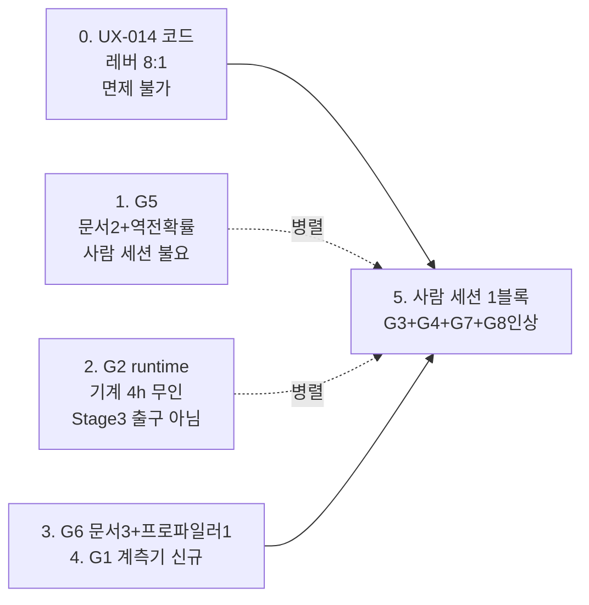

# 게이트 차단 해제의 임팩트 — 무엇이 바뀌고 무엇이 안 바뀌는가

- run-id: 20260809-castle-war-stage1 (cycle 3)
- lane: game-pm
- date: 2026-08-18
- next_public_beat: WebGL build linked from https://jellyggumi.github.io/ menu
- 입력: `qa/gate-measurements.md`, `production/task-manifest.md`,
  `retrospectives/cycle-2-retrospective.md`,
  `skill://game-studio-harness/references/quality-gates.md`,
  `production/gate-reviews/`, `production/decision-log.md`
- **baseline (코드 인용의 기준)**: `feature/hero-growth-series` @ `2333e93e`.
  `HEAD`는 값이 아니다 — 브랜치를 말하지 않으므로(§5.7). `origin/main`은 `873334c4`이고
  본 레인은 그쪽을 읽지 않았다. 라이브 배포 팁은 `73f79240`이며 세 기준이 서로 다르다(§3.7).
- 규칙: 모든 주장에 `파일:줄` 또는 명령+관측. 형용사는 게이트를 통과하지 못한다.

---

## 0. 요약 — 답이 세 겹으로 갈린다

**질문**: S1 차단이 해제되면 무엇이 바뀌는가.

**답 1 — 해제되지 않았다.** 인테이크 가설("4건 전부 닫혀 있으므로 차단은 착오")이
반증됐다. UX-014가 open이다(`production/decision-log.md`, DirectorArbitration 판정 1;
QA 반증을 본 레인도 독립 재확인 — `SiegeAlarmSystem.cs:217`의 `else if (!gm.IsPlayerTurn)`이
`:234`의 판독 분기를 선점하므로 판독 줄은 적 턴에 **도달 불가**하고, `:236` 주석이
*"The player's turn is exactly when last turn's result is worth reading"*로 그것을 확증한다).
계약이 "Any open S1 defect blocks every gate"이므로 **G1~G8 전부 여전히 차단이다.**

**답 2 — 해제됐다 해도 8개 중 통과 가능한 것은 0개다.** 아래 §1이 각 게이트의
독립 블로커를 나열한다. 미실시는 차단과 무관하게 미실시다.

**답 3 — 그리고 차단은 플레이어를 보호하고 있지 않다.** 이것이 본 레인의 주 발견이며
양방향 실측이다.

| | 상태 | 근거 |
|---|---|---|
| 닫힌 S1 3건(UX-001/002/003) | **이미 4일 전 플레이어에게 도달** | pages `36f7bc62` 2026-08-17 11:34:18Z. `git merge-base --is-ancestor 0cb0efb9 73f79240` → YES, 같은 명령 `9bd3494e` → YES |
| 라이브 실결함 **3건** | **미배포, 그리고 어떤 게이트도 막지 않음** | 웹툰 매트·기본 조준: `28226111` 미배포(`--is-ancestor 28226111 73f79240` → NO). 예보 스트립 부재: `709695ad`가 main에 있고 라이브에 없다(같은 명령 → NO). §3.2a·§3.5 |
| 라이브 빌드의 계보 | **어느 브랜치 팁에도 대응하지 않음** | 배포 후보 4개 전부 `--is-ancestor origin/main` → NO. `git rev-list --left-right --count origin/main...HEAD` → **14 7** |

즉 **차단 술어는 결함 대장을 보고 배포 상태를 보지 않는다.** 이미 고쳐서 배포한 것을
근거로 8개 게이트를 막고, 아직 배포하지 않은 실결함 3건은 아무 게이트도 막지 않는다.

> [!warning] "차단이 해제되니 통과한다"는 오류
> 이 문서에서 가장 경계한 문장이다. 차단 해제는 **PASS를 쓸 자격**을 돌려줄 뿐이고,
> 측정값·측정방법·증거경로 세 가지를 만들어주지 않는다. 계약이 바로 그 옆 줄에
> *"Missing evidence path = FAIL regardless of claimed value"*라 적어 두었다.

---

## 1. G1~G8 현황 — 지금 무엇으로 기록되어 있는가

`qa/gate-measurements.md`의 기록과, 본 레인이 파일 존재·코드로 교차확인한 결과를 함께 적는다.
**미실시와 FAIL은 다른 상태이므로 칸을 나눴다.**

| 게이트 | 기록된 판정 | 실제 상태 구분 | 독립 블로커 (S1 차단과 무관) | 근거 |
|---|---|---|---|---|
| **G1** 세계관 | FAIL | **미측정** — 측정을 시도한 적 없음 | 계측기 자체가 없다 | `gate-measurements.md:14` (측정값 `—`, 증거 `—`) |
| **G2** 밸런스 | FAIL | **부분 측정** — 수치는 밴드 내, 표본 미달 | 대칭 ≥20매치 **runtime** 승률 표본 부재 | `:15`, `:38-40` (고정 47.0% / 교대 53.0% / 첫-무버 47.0%, 전부 45–55 내). `:46` 이 심은 AI 오차곡선·Last Stand·플레이어 입력을 포함하지 않는다 |
| **G3** 아키타입 | FAIL | **미실시** | 로테이션 5종×5매치 세션 0회 | `:16`. `playtest-report.md:6` *"세션 미실시"*, `:44-50` 승률·턴 칸 **전부 공백** |
| **G4** 몰입 | FAIL | **미실시** | 8장면 채점 0회 **＋ 임계값이 S1/S2에 의존** | `:17`. `playtest-report.md:56-62` 채점 칸 전부 공백. 계약 임계값 *"0 unresolved readability complaints (S1/S2)"* |
| **G5** 매출 | FAIL | **문서 부재** — 측정은 대체로 존재 | `pm/reward-bands.md` **부재**, `pm/negotiation-record.md` **부재** | `:18`. 파일 존재 확인: 두 경로 모두 MISSING |
| **G6** 운영 | FAIL | **부분 측정** | perf 4항 미측정 · rollback 미실시 · release-readiness 부재 | `:19`. 텔레메트리 5/5 구현(`:197-201`) 및 실배포 종단 확인(`:314-325`, `dropped=0`). 미비: `:209-212`(p95·롱프레임·30분 소크·입력지연), `:213`(rollback 1회 미실시), `:214` |
| **G7** 코어루프 | FAIL | **미측정** — n=1은 표본이 아니다 | ≥20세션 필요, 현재 1세션 | `:20`. 실측 `repeatRate=0.0%`는 `:314`이고 `:324`가 *"첫 세션이므로 repeatRate 0.0%"*로 그 값이 계측 실패가 아님을 명시 |
| **G8** 참신성 | FAIL | **절반 측정** | QA 인상 점수 ≥4/5 미측정 | `:21`. 빈도 조건 충족(`:224-227` N-1 0/12, N-2 0/12, N-3 2/12, 새총 2/12). `:231` *"인상 점수: 미측정"* |

**통과 0 / 8.** 기록(`:23`)과 본 레인의 교차확인이 일치한다.

### 1.1 표에 안 들어가는 구조적 결손 — 판정을 적을 자리가 없다

계약은 *"QA owns measurement (`qa/gate-measurements.md`); the director owns the
verdict (`production/gate-reviews/{stage}-{gate}.md`)"*라 적는다. 실제:

```
$ ls -1 _workspace/current/production/gate-reviews/
stage1-rally-arbitration.md
$ grep -riEn "verdict|판정" _workspace/current/production/gate-reviews/
(출력 없음)
```

**G1~G8 어느 것도 판정 파일이 없고, 있는 한 파일에는 판정 문자열이 없다.**
`stage3-g4.md` / `stage3-g6.md` / `stage3-g1.md` 전부 MISSING(직접 확인).

함의: **오늘 어떤 게이트를 초록으로 측정해도 그것을 PASS로 기록할 자리가 없다.**
차단 해제 작업이 끝나도 이 결손이 남으면 게이트는 "측정됐으나 판정 없음"이 되고,
그 상태는 계약상 PASS가 아니다.

### 1.2 계약이 이름을 부른 파일 중 6개가 디스크에 없다

| 파일 | 계약이 요구하는 곳 | 존재 |
|---|---|---|
| `pm/reward-bands.md` | G5 evidence | **MISSING** |
| `pm/negotiation-record.md` | G5 evidence | **MISSING** |
| `engineering/perf-budget.md` | G6 evidence | **MISSING** |
| `ops/rollback-runbook.md` | G6 threshold | **MISSING** |
| `ops/release-readiness.md` | G6 threshold | **MISSING** |
| `production/decision-log.md` | 면제·스코프 결정 | **오늘 생성됨** (23,710 bytes, 15:39 — DirectorArbitration) |
| `design/core-loop.md` | G7 | EXISTS 56L |
| `design/novelty-scorecard.md` | G8 | EXISTS 77L |
| `design/worldview.md` | G1 | EXISTS 37L |
| `design/balance-sheet.md` | G2 | EXISTS 119L |
| `qa/playtest-report.md` | G3·G4·G7 | EXISTS 105L (표는 공백) |

`decision-log.md`가 **오늘까지 없었다**는 사실이 별개 위험이다 — 계약의 면제 조항과
3회 실패 시 스코프 결정 조항이 **기록될 자리 없이** 운영돼 왔다.

---

## 2. 재측정 우선순서 — 순서와 그 이유

버킷 목록이 아니라 **순서**로 적는다. 각 단계의 이유는 "왜 이것이 다음인가"이고,
비용은 사람 시간 / 기계 시간으로 나눈다.

### 순서 0 — UX-014 경로의 코드 (사람+코드, 차단 해제의 유일한 문)

**이것이 0번인 이유는 레버비가 8:1이기 때문이다.** 계약이 "Any open S1 blocks every
gate"이므로 **한 건의 상태가 8개 게이트를 동시에 지배한다.** 다른 어떤 작업도 이 비율을
갖지 못한다.

그리고 **면제로 우회할 수 없다**(decision-log 판정 2): G4 임계값이
*"0 unresolved readability complaints (S1/S2)"*로 면제 대상 클래스를 **명명**하므로
G4에 대한 면제는 순환이다. 즉 문서 작업으로 이 문을 열 수 없고 **코드가 필요하다.**

부수 발견 — **S2가 S1의 해제 경로를 막는다.** UX-014의 심각도를 재평가하려면 적 턴을
측정해야 하는데 그 캡처가 UX-015(S2)로 미착수다(`ux-defect-list.md:123`: 캡처 호출 3건
`ux-1-title`/`ux-2-match-start`/`ux-3-player-turn`뿐, `AITurn` 캡처 코드 없음).
**측정 없이 심각도를 내리면 이 사이클이 다섯 번 기록한 실패의 여섯 번째가 된다.**

### 순서 1 — G5 (사람 시간 소, 기계 0). **가장 싸게 닫힌다.**

이유는 임계값 4개 중 2개가 **공허참**이고 나머지 2개의 측정이 이미 있다는 것이다.

```
$ grep -rln "UnityEngine.Purchasing\|IStoreListener\|InitiatePurchase" Assets/Scripts/ Assets/Editor/
(출력 없음 — 파일 0건)
```

`purchasing 5.4.2` 패키지는 설치돼 있으나(`task-manifest.md:97`) **코드에서 아무도 쓰지 않는다.**

| G5 임계값 | 상태 |
|---|---|
| Paid/free win-rate delta ≤5%p | **공허참** — 유료 지점 0개. 단, 이 사실을 문서에 적어야 성립한다 |
| every revenue point has a signed negotiation-record entry | **공허참** — 대상 0개. 같은 조건 |
| comeback instant-reversal ≤30% per activation **with recorded cap/cooldown** | cap/cooldown은 코드로 고정됨 — `ComebackAsymmetryTests.cs:112` `CampingTheDangerBandCannotReArmTheComeback`, `:35` `AtTheShippedShot_TheCapErasesTheMultiplierAsymmetry` 등 5핀. **그런데 ≤30% 확률 자체는 어디에도 측정돼 있지 않다**(`grep -rn "역전\|reversal" _workspace/current/qa/*.md` → 해당 항목 0건) |
| free-path parity 10–20 session band | 미기술 — `reward-bands.md`가 써야 할 것 |

**따라서 G5는 "PM 레인 부재"가 아니라 "PM 문서 2개 부재 + 역전확률 1건 미측정"이다.**
전자는 본 레인의 산출물이고 후자는 심으로 측정 가능하다(무저항 점령 6.0초 경로에
cap/cooldown이 없다는 미해결 위험 D-6도 여기서 계상해야 한다 —
`retrospectives/cycle-2-retrospective.md:134`).

G5를 1번에 두는 이유는 싸기 때문만이 아니다. **G5는 사람 세션을 요구하지 않는 유일한
미착수 게이트**이므로, 사람 세션을 기다리는 동안 병렬로 끝낼 수 있는 유일한 항목이다.

### 순서 2 — G2 runtime 표본 (기계 시간 대, 사람 0). **지금 걸어두면 공짜다.**

이유는 **무인으로 돌고 다른 순서를 막지 않기 때문이다.** 사람이 아무것도 하지 않는
동안 기계가 표본을 만든다. 회고가 M2에서 측정한 실비용이 근거다 —
"조건당 26경기 × 4조건 ≈ 4시간 연속 실행"(`cycle-2-retrospective.md:180`).

주의 두 가지:
1. **G2는 Stage 3 exit 게이트가 아니다.** 계약의 스테이지 매핑은 Stage 2가 G2를 요구하고
   Stage 3은 G4·G6 final·G1 final을 요구한다. 즉 G2는 **밀린 부채**이고 이번 스테이지의
   출구는 아니다. 그래서 1번이 아니라 2번이며, 무인이라 병렬로만 정당화된다.
2. 수치는 이미 밴드 안이다(47.0/53.0/47.0). 부족한 것은 **runtime 표본**이지 튜닝이 아니다.
   여기서 값을 만지면 이 사이클이 20번 배운 실패(측정 없이 조정)의 반복이다.

### 순서 3 — G6 (문서 3 + 프로파일러 1세션). **가장 큰 미측정 덩어리이면서 사람이 거의 안 든다.**

이유는 **Stage 3 exit 게이트인데 blocker가 전부 기계 측정과 문서**라는 것이다.
텔레메트리는 이미 5/5 구현이고 실배포 빌드에서 종단 확인됐다(`gate-measurements.md:314-325`).
남은 것은 perf 4항 + rollback 1회 + release-readiness 체크리스트다.

perf 4항(p95 프레임 ≤16.7ms / 롱프레임 <0.5% / 30분 소크 / 입력 ≤100ms)은 **한 번의
프로파일러 세션**으로 4개가 같이 나온다. 문서 3개는 그 값을 담는 그릇이다.

### 순서 4 — G1 (사람 0, 그러나 계측기를 만들어야 한다)

이유는 **Stage 3 exit 게이트이고 사람이 전혀 필요 없는데, 유일한 비용이 계측기**라는 것이다.
그래서 3번 뒤다 — G6은 계측기가 있고 G1은 없다.

계측기의 절반은 이미 있다. `Assets/Editor/FontGlyphAudit.cs`(76줄)가
`Assets` 전체에서 `*.cs`,`*.unity`,`*.prefab`,`*.asset`,`*.json`을 순회한다(`:35-38`).
**그런데 그것은 문자를 모으고 문자열을 모으지 않는다**(`:46` `foreach (char c in text)`).
G1 임계값은 *"100% of shipped strings/effects/scenarios trace to design/worldview.md"*이므로
**문자열 추출과 worldview 대조가 신규 작업**이다. 파일 순회부는 재사용된다.

### 순서 5 — G3 · G4 · G7 · G8-인상 (사람 세션 1블록). **네 게이트가 한 세션을 공유한다.**

**이것이 이 절의 핵심이고, 순서를 정하는 이유가 비용이 아니라 결합이다.**

| 게이트 | 필요한 것 | 같은 세션에서 나오는가 |
|---|---|---|
| G3 | 아키타입 5종 × 5매치 | 세션 본체 |
| G4 | 8장면 몰입 채점 ≥4.0/5 + 지연 ≤100ms 스팟체크 | 같은 세션에서 채점 |
| G8 | 인상 점수 ≥4/5 | 같은 세션에서 채점 |
| G7 | 재진입률 ≥70%, ≥20세션 | 같은 세션의 텔레메트리 |

`playtest-report.md:28-34`가 아키타입 5종을 **이미 정의해 두었고** 각 타입이 무엇을 재는지
G3·G4·N-1 인상으로 매핑해 두었다. 즉 세션 설계는 끝나 있고 실행만 없다.

따로 돌리면 사람 시간이 3~4배가 된다. **한 블록으로 묶는 것이 이 순서표의 유일한
큰 절감이다.**

그리고 **이 블록은 순서 0 뒤여야 한다.** G4 임계값이 S1/S2 미해결 0건을 요구하므로,
UX-014가 open인 상태에서 세션을 돌리면 G3·G7·G8-인상은 얻지만 **G4는 그 세션에서 못
얻는다** — 가장 비싼 자원(사람)을 4개가 아니라 3개에만 쓴 것이 된다.

### 2.1 순서 요약



**0번만 직렬이다.** 1·2·3·4는 서로 독립이고 0번과도 독립이므로 0번이 도는 동안 전부
병렬로 진행 가능하다. 5번만 0번의 완료를 기다린다.

---

## 3. `next_public_beat`와의 거리 — 그리고 배포-커밋 대응 확인 결과

`next_public_beat`는 "WebGL build linked from https://jellyggumi.github.io/ menu"다.
**직전 사이클이 "배포 증거 상실"을 보고했으므로 그것이 지금도 맞는지 실제로 확인했다.**

### 3.1 마지막 배포는 언제 무엇인가 — 부분적으로 복원됐다

라이브를 직접 쟀다.

```
$ curl -sI https://jellyggumi.github.io/games/castle-war/Build/castle-war.data.unityweb
len=75160366  lastmod=Mon, 17 Aug 2026 11:38:01 GMT
  (wasm 15358924 / framework 81079 / loader 48106, 전부 같은 lastmod)
```

pages 저장소 이력에서 그 배포를 특정했다.

| pages 커밋 | 날짜(UTC) | 작성자 | source 해시 | 메시지 |
|---|---|---|---|---|
| **`36f7bc62`** | **2026-08-17 11:34:18** | akillness | **NONE** | deploy(castle-war): match-length model fix — the equation had lost a factor of 2 |
| `c99290a7` | 2026-08-14 14:23:44 | akillness | NONE | cycle-2 merge — stage3 castle fix, handicap, legibility |
| `ad0226e1` | 2026-08-14 02:44:48 | akillness | NONE | the forecast strip, this time actually present in a match |
| `0fd89cbe` | 2026-08-14 02:12:40 | akillness | NONE | launcher motion and impact VFX alongside the HUD visibility work |
| `c020b8f2` | 2026-08-13 16:08:53 | akillness | NONE | visible wind and score, next-shot forecast, turn progress |
| `8829ec8e` | 2026-08-13 15:16:32 | akillness | **NONE** | PR#44 cycle-2 work plus the destroy-reentrancy fix |
| `c41fd52e` | 2026-08-13 05:44:30 | akillness | **`c24d86d8`** | keep no longer detonates its own core (source c24d86d8) |

**증거 상실의 정체가 확정됐다: `(source <hash>)` 규약이 `8829ec8e`(2026-08-13 15:16)부터
사라졌다.** 그 이후 6건 전부 NONE이다. 마지막으로 소스를 기록한 배포는 `c41fd52e`다.

### 3.2 그래서 정확한 소스 커밋은 — 모른다. 4개로 좁혀진다.

배포 메시지 *"match-length model fix — the equation had lost a factor of 2"*는 로컬
`3da3dd9c fix(model): the equation lost the factor of 2, and the shipped constant hid it`과
**문장 단위로 대응**한다. 배포 시각(2026-08-17 20:34 KST) 당시 리포지토리 팁은
`73f79240`이었다(다음 커밋 `28226111`이 2026-08-18).

| 후보 | 게임 소스 변경 | 판단 |
|---|---|---|
| `3da3dd9c` | `MatchLengthModel.cs` 44줄 | 메시지가 지목하는 커밋 |
| `747f926d` | `MatchLengthModel.cs` 21줄 — 실질은 `AttackerTurnsToRemove` → `AttackerShotsToRemove` 개명 1건 | 동작 동일, 심볼 상이 |
| `4861a266` | **0건** | 규칙 문서만 |
| `73f79240` | **0건** | 테스트 증거 XML만. **배포 시각의 팁 — 가장 유력** |

**정직한 결론**: 소스 해시는 **복원 불가**이고 위 4개 중 하나다. 다만
**게임 동작은 네 후보에서 동일하다** — 두 후보가 게임 소스 0건이고 나머지 한 건의
차이가 메서드 개명이므로. 따라서 *"라이브가 무엇을 하는 빌드인가"*는 답할 수 있고
*"어느 커밋에서 빌드됐나"*는 답할 수 없다.

부수 확인: 로컬 `webgl-build.log`는 **2026-08-13 21:57**이 마지막이고 배포 창(08-17)의
빌드 로그가 이 머신에 없다. 그 배포는 다른 세션(`akillness`)이 다른 머신에서 수행했다는
뜻이고, 그래서 로컬에는 흔적이 없고 원격 pages만이 증거다.

### 3.2a 그리고 더 나쁜 것 — 라이브 빌드는 **어느 브랜치 팁에도 대응하지 않는다**

DirectorArbitration이 로컬 조상 검사를 교차확인하며 `28226111`이 main에 없다고 보고했다.
그 실을 당기니 배포 계보의 성질이 바뀐다.

```
$ git rev-parse --abbrev-ref HEAD          → feature/hero-growth-series
$ git rev-parse --short origin/main        → 873334c4
$ git rev-list --left-right --count origin/main...HEAD   → 14   7
$ git merge-base --is-ancestor 73f79240 origin/main      → NO
```

**배포 후보 4개 전부 `origin/main`에 없다**(네 커밋 모두 `--is-ancestor origin/main` = NO).
`origin/main`의 팁 `873334c4`는 2026-08-14 23:18이고 배포는 2026-08-17이다. 즉
**라이브 빌드는 미병합 피처 브랜치에서 나갔다.**

그 결과가 양방향 결손이다.

| 방향 | 개수 | 무엇이 |
|---|---|---|
| main에 있고 **라이브에 없다** | **14 커밋** | 그중 HUD 수정 2건이 플레이어에게 도달하지 않았다 (아래) |
| 라이브에 있고 **main에 없다** | **7 커밋** | 배포된 코드가 정본 브랜치에 없다 |

**main에만 있는 HUD 수정 2건 — 둘 다 라이브에 없다:**

```
$ git merge-base --is-ancestor 3107a13b 73f79240   → NO
$ git merge-base --is-ancestor 709695ad 73f79240   → NO
```

- `3107a13b fix(hud): draw the wind and the score, forecast the next shot, and map what QA …`
- `709695ad fix(hud): the forecast strip was never in the running game` (2026-08-14) —
  `GameManager.cs` 진단이 원인을 적는다: 예보 스트립을 `Start()`에서 지었더니
  **인트로가 아직 떠 있는 동안 생성돼 인트로 철거와 함께 사라졌고 `Start()`는 두 번
  돌지 않아 재건되지 않았다.** 수정은 매치 시작 지점으로 옮기는 것이며 신규
  `SiegeForecastLiveSceneTests.cs`(80줄)가 고정한다.

**따라서 라이브 실결함은 2건이 아니라 3건이다** — 웹툰 매트, 기본 조준, **예보 스트립 부재**.
세 번째는 main에 수정이 있고 라이브에 없다(앞의 두 건과 반대 방향의 결손이다).

> [!warning] `(source <hash>)` 규약 복원만으로는 부족하다
> §4.2(d)가 규약 복원을 제안하는데, 이 절이 그 제안의 요구사항을 하나 늘린다 —
> 해시만 적으면 *"어느 커밋"*은 답하지만 *"그 커밋이 정본 브랜치에 있나"*는 답하지
> 못한다. 배포 스크립트는 **브랜치 소속까지** 기록해야 한다.

### 3.3 낡은 문서 2건 — 배포 상태를 잘못 기술하고 있다

| 문서 | 무엇이라 적혀 있나 | 실제 |
|---|---|---|
| `qa/gate-measurements.md:362` | **B-8: "라이브 사이트가 아직 2022.3 빌드 — 6000 빌드는 로컬에만 존재"**, 막는 것: 배포 | **틀렸다.** 6000 재빌드 배포는 pages `ff6ac77`(2026-08-12 10:11:56Z, `task-manifest.md:105` 작업 #42)이고 **그 이후 pages에 12건이 더 올라갔다**(API 실측). 라이브는 2026-08-17 빌드다 |
| `ops/deploy-blocked-pages-credentials.md:5` | "빌드 성공·검증 완료, **공개 배포만 막힘**" (작업 #52, 2026-08-13) | **해소됐다.** `c020b8f2`(2026-08-13 16:08) 메시지가 *"visible wind and score, next-shot forecast, turn progress"* — 정확히 그 가시성 v2 작업이다. 다른 세션이 배포했다 |

그리고 **매니페스트에 배포 5건이 누락됐다.** 작업 #53(blocked, 2026-08-13) 이후
`c020b8f2`·`0fd89cbe`·`ad0226e1`·`c99290a7`·`36f7bc62`가 pages에 올라갔으나
`task-manifest.md`에 대응 행이 없다.

### 3.4 그래서 이 박자에 가시성 변경이 갖는 의미 — 질문의 전제가 반쯤 틀렸다

과제는 *"이전 배포는 이 라벨들이 안 보이는 상태로 나갔을 것"*이라 전제했다.
**현재 라이브에 대해서는 틀렸다.**

```
$ git merge-base --is-ancestor 0cb0efb9 73f79240   # Adopt(windText/scoreText), UX-001·002
YES
$ git merge-base --is-ancestor 9bd3494e 73f79240   # DesignationOpen, UX-003
YES
```

`0cb0efb9`는 2026-08-13 13:11, `9bd3494e`는 2026-08-13 21:53이고 둘 다 배포 팁의 조상이다.
**바람과 점수는 2026-08-13 배포(`c020b8f2`)부터 라이브에서 보인다 — 약 4일째다.**

전제가 맞는 구간은 **2026-08-13 이전 배포**다. 그 시절 빌드는 정말로 바람·점수가 안
보였다. 지금은 아니다.

**따라서 이 박자에 대한 게이트 해제의 기여는 0이다.** 플레이어가 받을 것은 이미 받았고,
해제가 바꾸는 것은 **우리 장부**뿐이다.

### 3.5 반대로 — 라이브에 실결함 3건이 있고 게이트가 안 막는다

`28226111`(2026-08-18, 게임 소스 20파일 / 전체 36파일)이 미배포다.
`73f79240..HEAD` = **2커밋, 게임 소스 32파일 변경**.

**(a) 웹툰 프롤로그 11페이지가 단색 매트로 재생 중.**

```
$ git show 28226111 -- Assets/Resources/Webtoon/panel-01.jpg.meta
-  textureType: 0        →  +  textureType: 8
-  spriteMode: 0         →  +  spriteMode: 1
```

라이브는 아직 `textureType: 0`이므로 `WebtoonPrologueController.cs:242`의
`Resources.Load<Sprite>($"Webtoon/panel-{page.pageNo}")`가 null을 돌려주고, `:235-237`의
`Matte`(`page.tone` 단색)가 그 자리를 채운다. 11장 아트는 작업 #15가 생성해 커밋했는데
**임포터 설정 때문에 플레이어에게 도달하지 않는다.** 같은 커밋이 Gimmicks 4장도 고친다.

**(b) 기본 조준이 자기 성벽으로 발사된다.** 신규 `AimDefaultReachTests.cs`(221줄)가
그 회귀를 고정한다. 작업 #67이 원인을 기록했다 — `aimPower = 0.55`가 45°에서 x=−4.74,
자기 성벽 구간(x=−7..−4) 안.

**(c) 예보 스트립이 매치에 존재하지 않는다.** §3.2a에 근거를 적었다 — `709695ad`가
main에 있고 라이브에 없다. (a)·(b)와 **반대 방향의 결손**이라는 점이 중요하다: (a)·(b)는
수정이 피처 브랜치에만 있어 못 나갔고, (c)는 수정이 main에만 있어 못 나갔다.
**한 배포가 두 방향으로 동시에 뒤처져 있다.**

**세 결함 모두 S1/S2 대장에 없고 따라서 어떤 게이트도 막지 않는다.**
게이트는 8개가 전부 막혀 있고, 플레이어가 실제로 겪는 세 결함은 배포 큐에서 대기 중이다.
(c)는 UX-004·UX-005가 요구한 정보를 싣는 장치이므로 — `709695ad`가 지운 주석이
*"qa/ux-defect-list.md UX-004, UX-005"*를 인용한다 — **대장에 등재된 결함의 처방이
라이브에서 작동하지 않는** 사례이기도 하다.

### 3.6 네 건이 같은 형태다 — "처방이 구현됐다"는 닫혔다는 뜻이 아니다

DirectorArbitration이 본 레인의 §3.5c 발견을 판정으로 승격했다(D-2026-08-18-K).
세 결함이 **같은 구조이고 자리만 다르다** — 그리고 본 레인이 검증하는 동안 **네 번째**가 나왔다.

| # | 결함 | 처방 | 처방이 **없는** 자리 |
|---|---|---|---|
| 1 | UX-014 | 사후 판독 | **제어 흐름** — `SiegeAlarmSystem.cs:217`이 `:234`를 선점 |
| 2 | UX-004/005 | 예보 스트립 | **객체 수명**(`Start()` 1회) → 그리고 **배포**(main O / 라이브 X) |
| 3 | 웹툰 11장 | 임포터 수정 | **배포**(피처 브랜치에만) |
| 4 | UX-018 (QA 신규 등재) | 플레이어 샷 판독(파란 분기) | **턴 경계** — 봉인이 교대보다 앞선다(아래) |

네 번 다 코드는 존재했고 네 번 다 측정된 자리에 없었다. 따라서 대장의 closed 근거는
*"구현 커밋"*이 아니라 **"그 자리에서 관측됨"**이어야 한다.

**4번의 기전을 본 레인이 확정했다 — QA의 결론은 옳고 근거는 달랐다.**
`Seal()` 호출처는 코드 전체에 **1곳**(`GameManager.cs:2339`)이고 `:2343 EndTurn()`이 바로
뒤다. 그 호출처는 `WaitAndEndTurn`(`:2281`) 안이며 **양측이 공유**한다 — 플레이어
`LaunchManager.cs:1198`, AI `SimpleAI.cs:114`가 같은 `OnUnitLaunched`(`:2263`)를 거쳐
`:2268`에서 같은 코루틴을 띄운다. 적이 마지막에 봉인하므로 플레이어 턴의 `:234`가 잡는
`LatestLine`은 **적의 주황 줄**이고 `:241` 파란 분기는 정상 흐름에서 도달 불가다.

QA는 "봉인 없이 적 턴이 끝나는 경로 4개"를 단서로 들었으나 `SimpleAI.cs:43`·`:67`은
`OnUnitLaunched(null)`을 **호출하고**, `:2265`의 null 검사는 `activeUnits.Add`에만 걸리므로
`:2268`은 무조건 돈다 — **그 두 경로도 `Seal()`에 도달한다.** 옳은 기전은 더 강하다:

```
ShotTraceDirector.cs:248   if (!shotOpen) return;   ← LatestLine 손대지 않고 반환
ShotTraceDirector.cs:167   shotOpen = true;         ← BeginShot()에서만 (:163)
```

**도달하지만 no-op이다.** AI가 실제로 발사하지 않으면(`BeginShot` 미호출) 플레이어의 파란
줄이 덮이지 않는다. 진짜로 봉인을 건너뛰는 경로는 `SimpleAI.cs:94` 하나다
(`!TryCommitTurnShot()` → `yield break`, `OnUnitLaunched` 미호출).
즉 **파란 분기는 "죽은 코드"가 아니라 "적이 발사에 실패한 턴에만 사는 코드"**이고,
정상 플레이에서는 기대할 수 없다.

**그리고 그 커밋이 자기 원인을 우리보다 정확히 적어 두었다.**
`git log -1 --format=%B 709695ad`:

> The strip was built, committed, deployed and **reported as delivered**, and it does
> not exist in a running match. **Three pure-string tests passed the whole time, which
> is the same reason wind and score were invisible for so long: values asserted,
> pixels never checked.**

두 번째 문장이 이 사이클의 네 결함(UX-001/002 바람·점수, UX-004/005 예보)을 **하나의
원인**으로 묶는다 — 값은 단언되고 픽셀은 검사되지 않았다. 같은 메시지가 진단 과정도
적는다: `Ensure()`는 null을 돌려주지 않았고 생성 순서도 원인이 아니었으며, `Awake`/
`OnDestroy` 프로브로 **인트로 오버레이와 함께 철거되고 `Start()`는 두 번 돌지 않는다**는
것을 잡았다 — *"Measured rather than reasoned about, after two wrong diagnoses."*

**PM 함의**: `pin` 칸은 테스트 **이름**만 받으면 부족하고 **어느 자리에서 관측하는지**를
함께 받아야 한다(순수 / 씬 / 배포). 순수 문자열 단언 3개는 이 결함이 살아 있는 동안
계속 통과했다. §4.2(b)의 요구사항을 이 문단이 한 칸 늘린다.

### 3.7 QA의 교차 확인 — 판정은 두 브랜치에서 같다 (본 레인이 확인하지 않은 축)

본 레인은 작업 트리(`feature/hero-growth-series`)에서만 코드를 읽었다.
QaRegisterAudit이 `origin/main`에서 재확인했고 **네 건이 두 브랜치에서 동일**하다 —
UX-014 분기 순서 `:210 → :217 → :234` 바이트 동일, 입양 4줄 존재, UX-003b 게이트 존재
(줄 번호만 이동). 인용이며 본 레인이 재현하지 않았다.

**그 확인이 `shipped` 칸의 필요성을 확정한다**: `origin/main`을 기준으로 쟀다면
`SiegeForecastStrip.cs`가 **있는** 상태를 보고 UX-004/005를 닫았을 것이고, 라이브에는
없다. 즉 **어느 브랜치를 재느냐가 결함 상태를 뒤집는다.**

부수 — 격차 숫자 2개가 둘 다 맞다(끝점이 다르다):

```
origin/main...HEAD      → 14 7   (작업 트리 기준, HEAD=2333e93e)
origin/main...73f79240  → 14 5   (라이브 기준)
73f79240..HEAD          → 2      = 28226111, 2333e93e  (7 − 5 = 2)
```

**차이는 시점이 아니라 미배포 델타 그 자체다.** 그래서 `shipped` 값은 기준 팁을 명시해야
한다(`not-live vs 73f79240`) — 명시하지 않으면 다음 배포 후에 그 값의 뜻이 사라진다.

### 3.8 그리고 가시성 복원이 새 결함을 만들었을 가능성 — 이미 라이브다

DesignerVisibilityCheck 레인이 상수에서 유도한 것을 본 레인이 두 값만 검증했다.

| 확인 | 결과 |
|---|---|
| `ExplosiveBarrel.prefab:147` | `m_Mass: 0.8` — 확인 |
| `UnitController.cs:37` | `windForce / Mathf.Max(MinRuntimeMass, mass)` — 확인 |
| `GameManager.cs:2435` | 호박색 경계 `Mathf.Abs(currentWindForce) >= 3.5f` — 확인 |
| `GameManager.cs:117` | `windEffectRadius = 10f` — 확인 |

발사체는 3턴 강제 순환이므로 **표시된 같은 바람 숫자가 3턴 중 1턴은 25% 더 크게 작용한다**
(배럴 m=0.8 대 기사/궁수 m=1). 바람이 안 보이던 동안에는 무해했다 — 플레이어가 그
숫자로 보정을 배우지 않았으니까. **이제 보이므로 배우고, 3턴마다 배신당한다.**

PM 판단: 이것은 **G4 임계값이 명명한 "readability complaint" 클래스에 들어갈 후보**다.
확정하려면 사람 채점이 필요하고 그것이 순서 5다. 지금 등급을 주장하지 않는다.
다만 **UX-001/002를 닫은 수정이 G4를 막을 수 있는 결함을 만들었고 그것이 이미 라이브**라는
구조는 기록해야 한다. 이 사이클이 배운 §5("고친 것이 그것을 인용한 결정을 무효화한다")의
또 다른 계층이다.

---

## 4. 게이트가 아닌 리스크 — status를 누가 언제 갱신하는가

이 사이클이 "문서가 낡았다"는 진단으로 끝나면 다음에 또 생긴다. **실제로 이미 세 번
생겼다**는 것이 이 절의 근거다.

| # | 낡은 것 | 무엇이 잡았나 |
|---|---|---|
| 1 | `ux-defect-list.md`에 status 열 자체가 없음 | 인테이크 |
| 2 | `gate-measurements.md:362` B-8 "라이브는 2022.3" | 본 레인 — pages API + curl |
| 3 | `ops/deploy-blocked-pages-credentials.md` "배포만 막힘" | 본 레인 — pages 커밋 메시지 |
| 4 | `task-manifest.md`에 배포 5건 누락 | 본 레인 — pages 이력 대조 |

**공통 성질: 네 건 모두 "만들 때는 맞았고 유지되지 않았다."** 생성은 작업에 딸려 오므로
자동으로 일어나고, **유지는 아무 작업에도 딸려 오지 않으므로 사람이 기억해야 한다.**
사람이 기억해야 하는 공정은 샌다 — 4/4로 샜다.

### 4.1 처방의 원칙 — 사람은 판단만, 기계는 대조

| 종류 | 소유 | 이유 |
|---|---|---|
| 심각도 부여(S1/S2/S3) | **사람(director)** | 판단이고 자동화 대상이 아니다. 결함당 1회 |
| 면제 발행(이유+만료일) | **사람(director)** | 같음 |
| status **대조** | **기계** | 판단이 아니라 사실 확인이다 |
| 배포 도달 **대조** | **기계** | 같음 |

### 4.2 자동화 가능한 지점 5개

DirectorArbitration의 F-2("차단 술어를 집행 가능하게, 디스크를 걸어야 한다")와 정렬하되,
본 레인은 **배포 축**을 추가로 제안한다.

**(a) 스키마 게이트 — status 없는 행을 실패로 만든다**
심각도 열이 있고 status 열이 없으면 실패. 판정 3(status 부재 = open으로 읽음)을
집행 가능하게 만든다. **선언 목록을 걷지 말고 `qa/*defect*.md`를 디스크에서 글롭**해야
한다 — 목록을 걷는 테스트는 목록에서 빠진 것을 볼 수 없다(이 사이클의 E-1, 3계층으로
확장됨).

**(b) 핀 게이트 — "closed"가 테스트 이름을 요구한다**
status=closed인 행은 **핀 테스트 이름**을 적어야 하고, 게이트는 (1) 그 이름의 테스트가
스위트에 실재하는지 (2) 최신 결과 XML에서 통과했는지를 확인한다.
이것이 "고쳤다"와 "회귀가 막힌다"를 다른 칸으로 분리한다 — ProgrammerPinPlan이 찾은
`HudCanvasContractTests.cs:322`(`canvas == null` → `continue`)가 왜 필요한 장치인지의
증거다. 그 skip은 표본 정의로는 옳지만, **그것만 있으면 `Adopt` 한 줄이 지워져도
스위트가 녹색**이다.

**(c) 배포 도달 게이트 — 본 레인 제안**
status=closed인 행의 **근거 커밋이 라이브 배포 팁의 조상인지** 확인한다.
없으면 "closed(미배포)"로 강제 표기. §0의 비대칭이 생긴 원인이 정확히 이 대조의 부재다 —
*"고쳤다"와 "플레이어가 받았다"가 같은 칸에 적혀 있다.*

**세 칸이 독립임을 증명하는 2×2 — 오늘 실측된 두 결함이 서로 정반대다.**

| | `shipped` (라이브 도달) | `regression-guard` (회귀 방어) |
|---|---|---|
| **UX-001/002** (바람·점수) | **있음** — `0cb0efb9` 라이브 조상 YES | **없음** — `HudCanvasContractTests` +122줄이 `git diff --name-only`에 여전히 미커밋 |
| **UX-004/005** (예보 스트립) | **없음** — `709695ad` 라이브 조상 NO | **있음** — `SiegeForecastLiveSceneTests.cs` 80줄이 같은 커밋에 포함 |

**두 축에서 정확히 반대**다. 한 칸으로는 어느 쪽도 보이지 않는다 —
*"수정은 배포됐고 방어는 안 됐다"* 와 *"방어는 있고 배포가 안 됐다"* 가 같은 `closed`로
적히기 때문이다. QaRegisterAudit이 이 사례를 찾았고 본 레인이 두 축을 각각 재현했다.

**(d) 배포 계보 복원 — 해시와 브랜치를 스크립트가 생성한다**
`8829ec8e`부터 규약이 사라졌고 그래서 §3.2가 4개 후보로 끝났다. 배포 스크립트가
커밋 메시지를 **생성**하게 만들면 사람이 기억할 일이 없어진다.
`ops/deploy-blocked-pages-credentials.md:75`의 절차가 이미 메시지를 손으로 적게 되어
있으므로 그 줄을 아래로 바꾸는 것이 최소 변경이다 —
**해시만으로는 부족하고 브랜치가 함께 있어야 §3.2a를 잡는다**:

```bash
SRC=$(git -C ~/Desktop/castle-war rev-parse --short HEAD)
BR=$(git -C ~/Desktop/castle-war rev-parse --abbrev-ref HEAD)
git commit -m "... (source $SRC on $BR)"
```

**(e) 브랜치 정합 게이트 — §3.2a가 요구하는 것**
배포 직전에 `git merge-base --is-ancestor HEAD origin/main`을 확인한다. NO면
**차단하지 않고 경고와 함께 양방향 개수를 출력**한다
(`git rev-list --left-right --count origin/main...HEAD`). 차단하지 않는 이유: 피처
브랜치 배포는 정당한 경우가 있다(핫픽스). **막아야 할 것은 배포가 아니라 그 사실이
기록되지 않는 것**이다. 오늘의 `14 7`이 아무 문서에도 없었다는 것이 이 검사의 근거다.

### 4.3 어디에 붙이는가 — 새 의례를 만들지 않는 것이 요점

| 검사 | 붙일 곳 | 왜 새지 않는가 |
|---|---|---|
| (a) 스키마 · (b) 핀 | **EditMode 스위트** | 매 사이클 이미 돌린다(최신 근거: 540/540, `qa/evidence/g2/editmode-540-clean.xml`). 아무도 새 명령을 기억할 필요가 없다 |
| (c) 배포 도달 · (d) 계보 · (e) 브랜치 정합 | **배포 스크립트** | 배포는 이미 사람이 원해서 돌린다. 대조가 그 안에 있으면 건너뛸 수 없다 |

**사람이 기억해야 하는 것은 심각도 부여와 면제 발행 두 개로 줄어든다.** 둘 다 결함당
1회이고 판단이므로 자동화 대상이 아니다. 유지는 전부 기계로 넘어간다.

> 주의 — 위 5개는 **제안이고 구현이 아니다.** 오늘 디스크에 (a)~(e) 중 어느 것도 없다.
> 이 문서가 그것을 있는 것처럼 적으면 §4가 진단하는 바로 그 병이 된다.

### 4.4 남는 위험 하나 — 정본이 아직 선언되지 않았다

`ux-defect-list.md`(UX-001~017)와 `defect-register.md`(D-001~D-017)는 서로소이고
**둘 중 무엇이 정본인지 어느 문서도 적지 않는다.** (a)~(e)를 붙여도 두 대장 사이의
관계가 선언되지 않으면 기계가 어느 파일을 걸어야 하는지 모른다.
이것은 자동화 이전의 선언이며 director 소유다(decision-log 판정 5의 F-2가
"정본 선언 없으면 실패"로 이미 요구한다).

---

## 5. 이 문서가 틀렸다가 고친 것

계약이 요구하는 자기 정정 기록이다.

| # | 무엇을 틀렸나 | 무엇이 잡았나 |
|---|---|---|
| 1 | 인테이크를 받아 "S1 4건 전부 닫힘 → 차단 해제"를 전제로 게이트 표를 쓰려 함 | QaRegisterAudit의 분기 순서 반증. 본 레인이 `SiegeAlarmSystem.cs:210-244`를 직접 읽어 재확인 — `:217`이 `:234`를 선점한다 |
| 2 | "직전 사이클의 배포 증거 상실이 지금도 맞다"를 그대로 인용하려 함 | pages API 실측. **부분적으로 복원됐다** — 배포 시각·작성자·메시지는 있고 소스 해시만 없다. "상실"보다 정확한 표현은 "규약이 `8829ec8e`부터 끊겼다" |
| 3 | 과제의 전제("이전 배포는 라벨이 안 보이는 상태")를 받아쓰려 함 | `git merge-base --is-ancestor` — 바람·점수는 4일째 라이브다. 전제는 2026-08-13 **이전** 배포에만 맞다 |
| 4 | G5를 "pm 레인 부재로 측정 불가"로 적으려 함 | `grep`으로 유료 지점 0건 확인 — 임계값 4개 중 2개가 공허참이고 cap/cooldown은 이미 5핀으로 고정돼 있다. G5는 **가장 싼 게이트**이며 그 반대로 적을 뻔했다 |
| 5 | "미배포 커밋은 게이트와 무관"으로 넘기려 함 | 웹툰 임포터 대조 — 라이브에서 프롤로그 11장이 매트로 재생 중. 게이트가 막지 않는 실결함이 있다는 것이 §0의 절반이 됐다 |
| 6 | §3.2를 "소스 커밋만 모르고 나머지는 안다"로 닫으려 함 | DirectorArbitration이 `28226111`이 main에 없다고 보고 → 실을 당기니 **배포 팁 자체가 main에 없다**(`--is-ancestor 73f79240 origin/main` = NO, 양방향 `14 7`). 몰랐던 것은 커밋 하나가 아니라 **어느 브랜치에서 배포됐는지**였고, 그래서 라이브 실결함이 2건이 아니라 3건이 됐다(§3.2a·§3.5c). 자동화 제안도 4개에서 5개로 늘었다 |
| 7 | 코드를 **작업 트리에서만** 읽고 판정을 적었다 — 어느 브랜치를 읽고 있는지 문서에 밝히지 않았다 | QaRegisterAudit이 `origin/main`에서 네 건을 재확인했다(동일). **틀린 판정은 아니었으나 확인하지 않은 축이었다** — `origin/main`에는 `SiegeForecastStrip.cs`가 있고 작업 트리에는 없다(`git cat-file -e` / `[ ! -f ]` 확인). 그 축을 안 밝힌 채 "라이브에 없다"를 적으면 다음 사람이 어느 기준인지 모른다. §3.7로 명시 |
| 8 | 격차 `14 7`을 브랜치의 성질처럼 적었다 | QA가 `14 5`를 측정해 불일치가 드러났고, QA는 "브랜치가 움직였다"로 읽었다. **둘 다 틀렸다** — 끝점이 다른 것이고 `7 − 5 = 2`가 정확히 미배포 델타(`28226111`, `2333e93e`)다. 숫자는 브랜치의 성질이 아니라 **질문의 성질**이며, 그래서 `shipped` 값에 기준 팁 표기가 필요하다(§3.7) |
