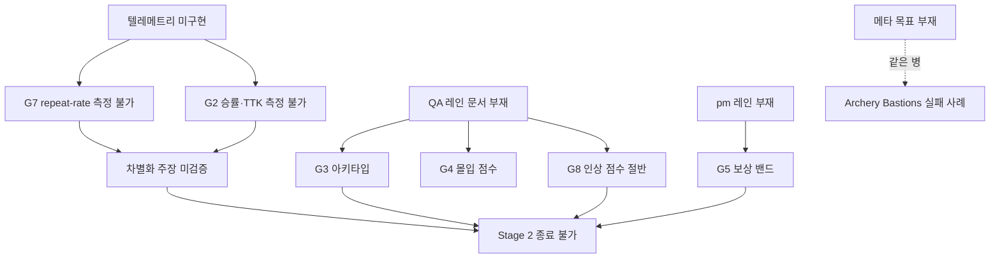

# Gap analysis — 조사가 지목한 것 vs 현재 빌드

- run-id: 20260809-castle-war-stage1
- owner: game-production-director lane
- date: 2026-08-12
- 근거: `.survey/siege-artillery-landscape/`, `design/novelty-scorecard.md`,
  `references/quality-gates.md`, `references/artifact-contract.md`, 코드 실측
- 상태: **조사 완료 / 실행 결정 대기 (사용자 인터뷰 중)**

---

## 요약 — 두 종류의 갭이 있다

```
[A] 장르 갭   조사가 지목한 약점 중 우리도 앓고 있는 것        → 게임이 덜 재밌어지는 문제
[B] 구조 갭   하네스 게이트가 요구하는데 없는 것              → 게임이 좋은지 알 수 없는 문제
```

**B가 A보다 먼저다.** A의 해법이 효과 있었는지를 B 없이는 측정할 수 없기 때문이다.
지금 8개 게이트 중 **통과 가능한 것이 0개**이며, 그 이유는 대부분 "나쁘다"가 아니라
**"측정된 적 없다"** 이다.

---

## [A] 장르 갭 — 조사 근거가 있는 것만

### A1. 메타 목표 부재 — 우리도 같은 병을 앓는다 🔴

조사에서 가장 강한 경고였다. Archery Bastions 396레벨 플레이어:

> "궁극적 목표가 없어 쉽고 반복적이다… 전체 지도와 보스 레벨이 필요하다"
> — 미사용 골드 **100만** 보유

**우리 실측:**

| 항목 | 값 | 함의 |
|---|---|---|
| 스테이지 | 3개 | |
| 해금 조건 | 3판 2선승 시리즈 | |
| **전체 콘텐츠** | **시리즈 3회** | 이후 할 것이 없다 |
| 시리즈 승리 보상 | 12 마크 | `SiegePrototypeEconomy.SeriesVictoryMarks` |
| 구매 가능 항목 | 배너 인장 **1종, 12 마크** | `BattleBannerSealPrice` |
| **경제 수명** | **시리즈 1회로 소진** | 두 번째 승리부터 마크가 무의미 |

영속 저장은 4개 키뿐: 해금 프론티어 / 마크 잔액 / 배너 인장 / 연대기 팩.
**같은 병이고 규모만 더 작다.**

### A2. 우리의 핵심 차별화 주장이 미검증 🔴

조사의 핵심 논거는 **"반격이 있으면 단방향 퍼즐의 반복성이 구조적으로 해소된다"** 이다.
Crush the Castle이 GameZebo 2/5를 받은 이유("매우 반복적")를 우리가 푼다는 주장.

그런데 이걸 재는 지표인 **G7 repeat-rate ≥70%가 `[TARGET]`** 이다.
`design/core-loop.md`가 직접 인정한다:

> "2분 루프 동일 세션 캡처가 없으므로 G7은 열려 있다"

**차별화 주장 = 미검증.** 참신성 스코어카드(G8)도 QA 인상 점수가 없어 절반이다.

### A3. 진입 장벽 해법이 반쪽 🟡

포병 계보의 병은 진입 장벽이고(포트리스 유저가 "각샷"을 외운다), 우리 답은 궤적 프리뷰다.
프리뷰는 **있다**(300스텝·6초, 실전 물리 동일).

없는 것: **구조화된 온보딩.** 코드 전수 검색 결과 튜토리얼 시스템 0건.
`SiegeAlarmSystem` 토스트와 유예 코칭은 있으나 **첫 플레이 학습 경로가 아니다.**

프리뷰는 "이 샷이 어디 가나"를 답하지만 **"왜 당겨야 하나"** 는 답하지 않는다.

### A4. PvP 부재 — 결정인가 누락인가 🟡

포병 계보 6개(포트리스2·Gunbound·Worms·Scorched Earth·ShellShock·Pocket Tanks)가
**전부 대인 대전**이다. 포트리스2는 e스포츠 종목까지 갔다.

우리는 vs AI 전용. 코드 전수 검색 결과 네트워크/멀티플레이 코드 **0건**.

이게 나쁘다는 뜻이 **아니다** — 웹 아케이드 단독 플레이는 정당한 선택이다.
문제는 **그 선택이 어디에도 기록되어 있지 않다는 것.** 문서가 없으면 다음 세션이
"빠뜨렸다"고 읽고 되살리려 든다.

### A5. 재료 사다리가 짧다 🟢

1435 → 1690 → 1965로 잘 설계된 사다리인데 **칸이 3개**다. A1의 하위 증상.

---

## [B] 구조 갭 — 게이트가 요구하는데 없는 것

### 레인 감사

| 레인 | 상태 | 없는 것 |
|---|---|---|
| `intake/` | ✅ | |
| `design/` | ✅ 10문서 | |
| **`pm/`** | ❌ **통째로 없음** | revenue-map · **reward-bands(G5)** · negotiation-record · revenue-forecast |
| `engineering/` | ⚠️ 1문서 | architecture-contract · **perf-budget(G6)** · movement-optimization |
| `qa/` | ⚠️ 2문서 | test-plan · benchmark-notes · **playtest-report(G3/G7)** · exploit-register · **gate-measurements(전 게이트)** |
| `ops/` | ⚠️ 1문서(draft) | **rollback-runbook(G6)** · **release-readiness(G6)** |
| `ui/` | ❌ | (선택적) |
| `production/` | ✅ | |
| `messages/` | ✅ | |
| **`retrospectives/`** | ❌ | 사이클 종료 아티팩트 |

### 텔레메트리 — 계약서만 있고 코드 0

`ops/telemetry-contract.md`가 5개 필드를 정의하나 스스로 `[TARGET]`으로 표기.
**`Assets/Scripts/` 전수 검색 결과 텔레메트리/애널리틱스 코드 0건.**

이게 A2와 직결된다 — **repeat-rate를 잴 수단이 없어서 못 재는 것.**

---

## 게이트 현황 — 통과 가능 0 / 8

| 게이트 | 요구 | 상태 | 막는 것 |
|---|---|---|---|
| G1 세계관 일관성 | 위반 0건 감사 | 🟡 draft | 전수 감사 미실시 |
| G2 규칙·밸런스 | 승률 45–55%, TTK ±15% | 🔴 **미측정** | 시뮬레이션 없음 |
| G3 플레이어 타입 | ≥3 아키타입 독립 성립, ≥5 테스트 | 🔴 **미착수** | playtest-report 없음 |
| G4 이펙트 몰입 | 중앙값 ≥4.0/5 | 🔴 **미측정** | 점수 체계 없음 |
| G5 매출·밸런스 | 무과금 격차 ≤5%p, 역전 ≤30% | 🔴 **pm 레인 부재** | reward-bands 없음 |
| G6 운영 | 텔레메트리 가동, p95 ≤16.7ms | 🟡 draft | 구현 0, perf 표 없음 |
| G7 코어 루프 | repeat-rate ≥70% | 🟡 draft | 측정 수단 없음 |
| G8 참신성 | ≤2/5 빈도 **AND** 인상 ≥4/5 | 🟡 **절반** | 빈도 ✅ / 인상 ❌ |

**Stage 2 종료 조건은 G2·G3·G5·G7final·G8이고, 5개 전부 막혀 있다.**

---

## 인과 구조 — 무엇을 먼저 풀어야 하는가



**텔레메트리 하나가 G2·G7 두 게이트를 동시에 막고 있고,
그 두 개가 우리 차별화 주장(A2)의 유일한 증명 수단이다.**

---

## 후보 작업 (실행 결정 전)

| # | 작업 | 푸는 것 | 규모 |
|---|---|---|---|
| **W1** | 텔레메트리 구현 (localStorage 링버퍼 + 덤프) | G7·G2 측정 가능 → A2 검증 | 중 |
| **W2** | QA 레인 세우기 (test-plan·아키타입 5종·gate-measurements) | G3·G4·G8 | 중 |
| **W3** | pm 레인 세우기 (reward-bands·negotiation-record) | G5 | 소 |
| **W4** | 메타 목표 (스테이지 추가 / 별점 목표 / 영웅 영속화) | A1·A5 | 대 |
| **W5** | 온보딩 (첫 3턴 학습 경로) | A3 | 중 |
| **W6** | PvP 결정 문서화 (하거나, 안 하기로 기록) | A4 | 소~대 |
| **W7** | ops 마감 (rollback·release-readiness·perf-budget) | G6 | 소 |

> 하네스 규칙: **한 사이클에 운영 모드 하나.** 개념 작업과 출시 운영을 한 패스에 섞으면 둘 다 약해진다.
> 따라서 위 7개를 다 하지 않는다 — **하나를 고르고 나머지는 다음 사이클로 명시 이월**한다.

**→ 사용자 인터뷰로 모드를 확정한 뒤 이 문서에 결정을 추기한다.**

---

## 실행 결정 (사용자 인터뷰 2026-08-12)

| 질문 | 결정 |
|---|---|
| 다음 사이클 운영 모드 | **측정 인프라 — 텔레메트리 + QA 레인** (W1+W2) |
| 메타 목표 방향 | **영웅 성장 영속화** — `ItemSystem` 스택을 시리즈/캠페인 단위로 영속화해 마크 경제에 소비처를 만든다 (이월) |
| PvP | **로컬 핫싯** — 턴제 교대 구조라 AI 자리에 사람 입력만 꽂으면 됨, 네트워크 0 (이월) |
| 텔레메트리 수집 | **localStorage 링버퍼 + 콘솔 덤프** — 서버 0, 개인정보 0 |

이월 항목은 방향이 확정되었으므로 다음 세션이 다시 묻지 않는다.
실행 계획은 `production/cycle-2-plan.md`.
